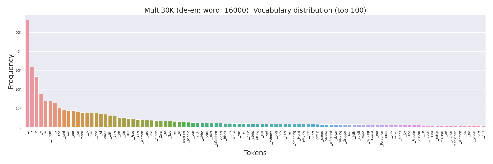
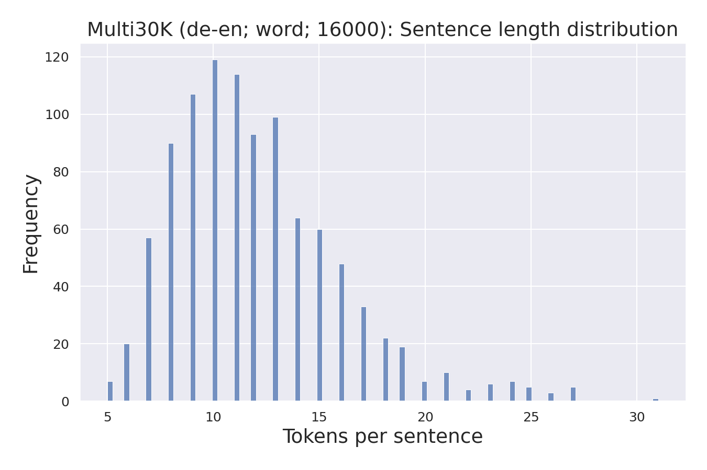

# AutoNLP

AutoNLP is a library to build seq2seq models with almost no-code, so that you can remain focused on your research.

**What do we offer?**
- Toolkit abstraction
- Automatic and replicable experimentation in grid for seq2seq models.
  - Automatic dataset preprocessing
  - Automatic training, fine-tuning and scoring
  - Automatic logging, reporting, plotting and statistics of the datasets and models

Despite our no-code approach, all the control remains in the user since all the intermediate steps (pretokenization, 
subword encodings, split sizes...) are:
- Saved in separated folders so that the user can inspect any part of the process (and reuse it)
- Produced using standard libraries (moses, sentencepiece, sacrebleu,...) that you can replicate via the command line.


## Installation

```
git clone git@github.com:salvacarrion/autonlp.git
cd autonlp
pip install -e .
```


## Usage

### Dataset generation

The `DatasetBuilder` is the object in charge of generating versions of your dataset from a reference one ("original"). If you don't know how to use it, 
run this code with `interactive=True` and it will guide you step-by-step to generate the reference dataset.

```python
from autonlp import DatasetBuilder

# Train datasets
tr_datasets = DatasetBuilder(
    base_path="some_folder",
    datasets=[
        {"name": "europarl", "languages": ["de-en"], "sizes": [("original", None), ("100k", 100000)]},
    ],
    subword_models=["word", "unigram"],
    vocab_sizes=[8000, 16000],
    force_overwrite=False,
    interactive=True,
).build(make_plots=True, safe=True)

# Test datasets
ts_datasets = tr_datasets
```


### Train & Score

The `Translator` object abstracts the seq2seq pipeline so that you can train and score your custom models effortless. Similarly, 
you can use other engines such as `fairseq` or `opennmt`.

```python
import autonlp as al

for ds in tr_datasets:
    # Define translator
    model = al.Translator(ds, engine="fairseq")

    # Train & Score
    model.preprocess()
    model.train()
    model.evaluate(eval_datasets=tr_datasets, beams=[1, 5])
    model.score(eval_datasets=ts_datasets, metrics={"bleu", "chrf", "ter" "bertscore", "comet", "beer"})
    
    # Make plots
    model.make_plots()
```

### Custom models

To create your custom pytorch model, you only need inherit from `Seq2Seq` and then include it to the training pipeline with: `model.train(custom_model=Transformer)`

```python
from autonlp.models import Seq2Seq

class Transformer(Seq2Seq):
    def __init__(self, *args, **kwargs):
        super().__init__()
        # Your model        

    def forward(self, X, Y):
        # Stuff
        return output  # (B, L, probs)
```


**Plots & Stats:**

AutoNLP will automatically generate plots for the split sizes, the sentence length distributions, 
token frequencies, the evaluated models, etc. All these plots can be found along with either a .json or a .csv 
containing its data, summary and statistics




