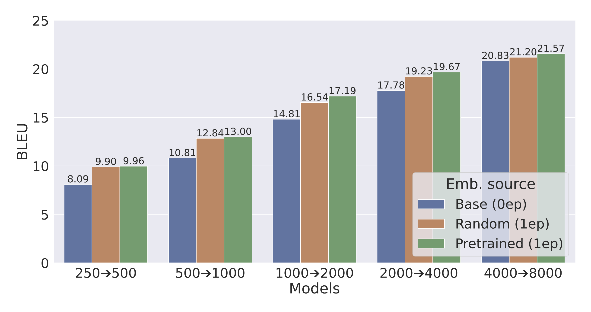
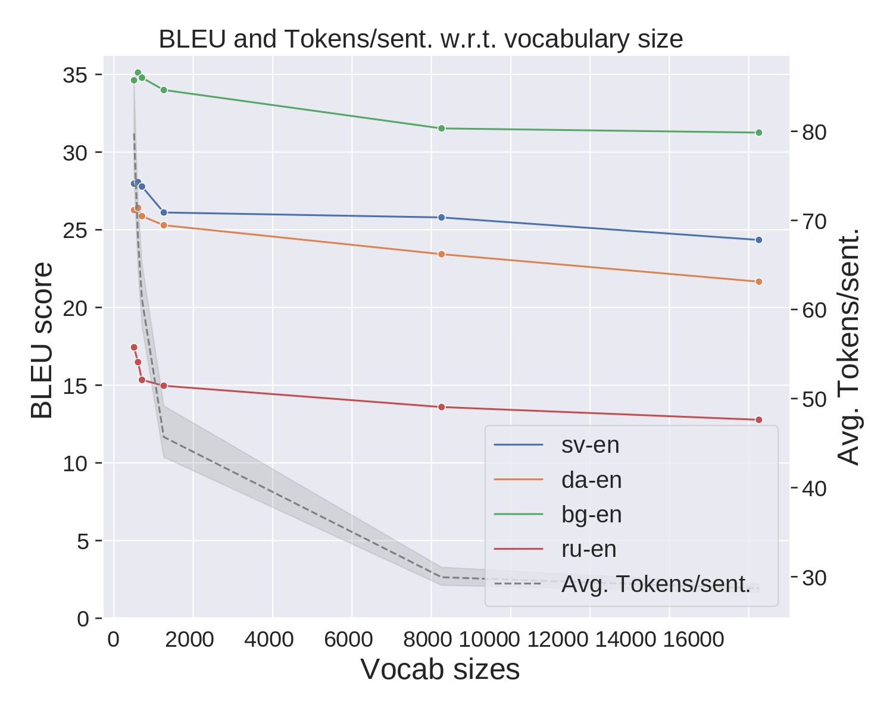
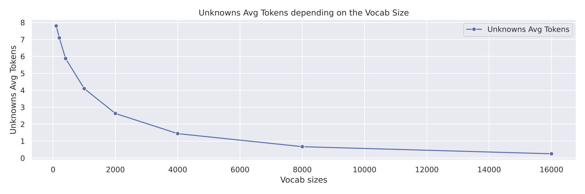

# AutoNMT


 *Scikit-learn but for Seq2Seq tasks*

--------------------------------------------------------------------------------

[](https://github.com/salvacarrion/autonmt/actions/workflows/python-package.yml)


**AutoNMT** is a Python library that allows you to research seq2seq models by providing two high-level features:

- Automates the grid experimentation: Tokenization, training, scoring, logging, plotting, stats, file management, etc.
- Toolkit abstraction: Use your models, our models, or different libraries such as Fairseq or OpenNMT, changing a single of code.


**Why us?**

We follow an **almost-no code** approach so that you can remain focused on your research without wasting time learning 
the inner workings of another toolkit.


**Reproducibility**

Reproducibility is a must in research. Because of that, we only use reference libraries that produce shareable, 
comparable, and reproducible results such as Sacrebleu, Moses or SentencePiece.

Furthermore, we provide two features for reproducibility:

- All the intermediate steps (raw files, tokenized, binaries, scores,...) are saved in separated folders so that a user can inspect any part of the process (and reuse it in other projects) and, we also output all the commands use to compute
- We also output the exact commands used for the reference libraries, so you can replicate any part of the process for yourself


## Installation

Tested on Python 3.8-3.11

```
git clone git@github.com:salvacarrion/autonmt.git
pip install -e autonmt/
```


## Usage

You check full examples [here](examples).

### Dataset generation

The `DatasetBuilder` is the object in charge of generating variants of your datasets ("original"). In other words, it 
creates versions of your original dataset, with different training sizes to test ideas faster, multiple vocabularies
lengths and variations (bytes, char+bytes, unigram, bpe, word), etc.

If you don't know how to use it, don't worry. Run the following code with the `interactive=True` argument enabled, 
and it will guide you step-by-step so that you can create a new dataset.


```python
from autonmt.preprocessing import DatasetBuilder

# Create preprocessing for training
builder = DatasetBuilder(
    # Root folder for datasets
    base_path="datasets/translate",
    
    # Set of datasets, languages, training sizes to try
    datasets=[
        {"name": "europarl", "languages": ["es-en", "fr-en", "de-en"], "sizes": [("original", None), ("100k", 100000)]},
        {"name": "scielo/health", "languages": ["es-en"], "sizes": [("100k", 100000)], "split_sizes": (None, 1000, 1000)},
    ],
    
    # Set of subword models and vocab sizes to try
    encoding=[
        {"subword_models": ["bpe", "unigram+bytes"], "vocab_sizes": [8000, 16000, 32000]},
        {"subword_models": ["bytes", "char", "char+bytes"], "vocab_sizes": [1000]},
    ],
    
    # Preprocessing functions
    preprocess_raw_fn=lambda x, y: preprocess_pairs(x, y,...),
    preprocess_splits_fn=lambda x, y: preprocess_pairs(x, y,...),
    
    # Additional args
    merge_vocabs=False,
).build(make_plots=False, force_overwrite=False)

# Create preprocessing for training and testing
tr_datasets = builder.get_train_ds()
ts_datasets = builder.get_test_ds()
```

#### Format

Once you've run the above code, the program will tell you where to put your files. Nevertheless, it expects that all 
files contain one sample per line and their language code as their extension. 

For instance, there are two ways to create a dataset: 
- From raw files: `data.es` and `data.en` => `train.es`, `train.en`, `val.es`, `val.en`, `test.es` and `test.en`.
- From split files: `train.es`, `train.en`, `val.es`, `val.en`, `test.es` and `test.en`.

### Train & Score

The `Translator` object abstracts the seq2seq pipeline so that you can train and score your custom models effortless. Similarly, 
you can use other engines such as `fairseq` or `opennmt`.

```python
from autonmt.toolkits import AutonmtTranslator
from autonmt.modules.models import Transformer
from autonmt.vocabularies import Vocabulary

# Build datasets
# tr_datasets, ts_datasets = ...

# Train & Score a model for each dataset
scores = []
for train_ds in tr_datasets:
    # Instantiate vocabs and model
    src_vocab = Vocabulary(max_tokens=150).build_from_ds(ds=train_ds, lang=train_ds.src_lang)
    trg_vocab = Vocabulary(max_tokens=150).build_from_ds(ds=train_ds, lang=train_ds.trg_lang)
    model = Transformer(src_vocab_size=len(src_vocab), trg_vocab_size=len(trg_vocab), padding_idx=src_vocab.pad_id)

    # Define trainer
    runs_dir = train_ds.get_runs_path(toolkit="autonmt")
    run_name = train_ds.get_run_name(run_prefix="mymodel")
    trainer = AutonmtTranslator(model=model, src_vocab=src_vocab, trg_vocab=trg_vocab,
                                runs_dir=runs_dir, run_name=run_name)
    
    # Train model
    wandb_params = None  #dict(project="autonmt", entity="salvacarrion")
    trainer.fit(train_ds, max_epochs=5, learning_rate=0.001, optimizer="adam", batch_size=128, seed=1234,
                patience=10, num_workers=10, strategy="ddp", save_best=True, save_last=True, wandb_params=wandb_params)

    # Test model
    m_scores = trainer.predict(ts_datasets, metrics={"bleu", "chrf", "bertscore"}, beams=[1, 5], load_checkpoint="best",
                               preprocess_fn=preprocess_predict_fn, eval_mode="compatible", force_overwrite=False)
    scores.append(m_scores)
```


The evaluation will be performed only the compatible datasets (same source and target language).

It is worth to point out that the DatasetBuilder will create n variations for each unique dataset, therefore, n models
per unique dataset will be trained. Nevertheless, AutoNMT is smart enough to evaluate each model once per unique dataset
as the raw test files of each variation are the same (each model will encode its data).

#### Fit parameters

Our models are wrapped using Pytorch Lightning. Therefore, you can pass to the fit function all the parameters that 
training of pytorch lightning accepts (and more!).

Check the available parameters [here](https://pytorch-lightning.readthedocs.io/en/latest/common/trainer.html)

### Generate a report

This code will save the score of the multiple training (as json and csv), will create a summary of the results and will 
make a few plots to visualize the performance of the models.

```python
import datetime
from autonmt.bundle.report import generate_report

# Train models
# scores = ...

# Make report and print it
output_path = f".outputs/autonmt/run1"
df_report, df_summary = generate_report(scores=scores, output_path=output_path, plot_metric="translations.beam1.sacrebleu_bleu_score")
print("Summary:")
print(df_summary.to_string(index=False))
```

**Single toolkit output:**

```text
train_dataset  eval_dataset subword_model vocab_size  fairseq_bleu
multi30k_test multi30k_test       unigram       4000     35.123375
multi30k_test multi30k_test          word       4000     34.706139
```

**Multi-toolkit output:**

```text
train_dataset  eval_dataset subword_model vocab_size  fairseq_bleu  autonmt_bleu
multi30k_test multi30k_test       unigram       4000     35.123375     32.816378
multi30k_test multi30k_test          word       4000     34.706139     34.682657
```

> **Note:** AutoNMT didn't have some of the training parameters that Fairseq had.

### Toolkit abstraction

#### Custom models

To create your custom pytorch model, you only need inherit from `Seq2Seq` and then pass it as parameter to the `Translator` class. 
The only requirement is that the forward must return a tensor with shape `(batch, length, probabilities)`.

```python
from autonmt.toolkits import AutonmtTranslator
from autonmt.modules.seq2seq import LitSeq2Seq


class CustomModel(LitSeq2Seq):
    def __init__(self, src_vocab_size, trg_vocab_size, padding_idx, **kwargs):
        super().__init__(src_vocab_size, trg_vocab_size, padding_idx, **kwargs)

    def forward_encoder(self, x):
        pass
    
    def forward_decoder(self, y, memory):
        pass  # output = (Batch, Length, probabilities)
```

**Custom trainer/evaluator**

Our Seq2Seq base model is simply a wrapper that uses PyTorchLightning. If you need to write your custom Seq2Seq trainer, you can do it like this:

```python
import pytorch_lightning as pl


class LitCustomSeq2Seq(pl.LightningModule):
    # Stuff for Pytorch Lightning modules


class CustomModel(LitCustomSeq2Seq):
    def __init__(self, *args, **kwargs):
        super().__init__(*args, **kwargs)


# Custom model
model = AutonmtTranslator(model=CustomModel(...), ...)
```

#### Fairseq models

When using a Fairseq model, you can use it through the fairseq command-line tools:

```python
from autonmt.toolkits.fairseq import FairseqTranslator

# These args are pass to fairseq using our pipeline
# Fairseq Command-line tools: https://fairseq.readthedocs.io/en/latest/command_line_tools.html
fairseq_args = [
    "--arch transformer",
    "--encoder-embed-dim 256",
    "--decoder-embed-dim 256",
    "--encoder-layers 3",
    "--decoder-layers 3",
    "--encoder-attention-heads 8",
    "--decoder-attention-heads 8",
    "--encoder-ffn-embed-dim 512",
    "--decoder-ffn-embed-dim 512",
    "--dropout 0.1",
]

# Build datasets
# tr_datasets, ts_datasets = ...

# Train & Score a model for each dataset
scores = []
for train_ds in tr_datasets:
    # Define trainer
    runs_dir = train_ds.get_runs_path(toolkit="autonmt")
    run_name = train_ds.get_run_name(run_prefix="mymodel")
    trainer = FairseqTranslator(runs_dir=runs_dir, run_name=run_name)
    
    # Train model
    trainer.fit(train_ds, max_epochs=5, learning_rate=0.001, optimizer="adam", batch_size=128, seed=1234,
                patience=10, num_workers=10, strategy="ddp", fairseq_args=fairseq_args)

    # Test model
    m_scores = trainer.predict(ts_datasets, metrics={"bleu", "chrf", "bertscore"}, beams=[1, 5], load_checkpoint="best",
                               preprocess_fn=preprocess_predict_fn, eval_mode="compatible", force_overwrite=False)
    scores.append(m_scores)
```

> **Note:** 'fairseq_args' always has preference over the 'autonmt' parameters in case of a collision. This is because
> in order to provide framework compatibility using the same set parameters, we had to define a translation table of
> parameters between tookits (i.e. "max_epochs" (autonmt) => "--max-epoch" (fairseq). So if a user sets "max_epochs=10" 
> (autonmt) in the fit, and "--max-epoch 15" (fairseq) in the 'fairseq_args', we will consider the later.


### Plots & Stats

AutoNMT will automatically generate plots for the split sizes, the sentence length distributions, 
token frequencies, the evaluated models, etc. All these plots can be found along with either a .json or a .csv 
containing its data, summary and statistics

#### Plot model comparison



#### Plot statistics and model scores (...per vocab size)

**Avg. tokens vs BLEU:**



**Avg. number of unknowns per sentence:**



#### Plot distributions

**Vocabulary distributions:**


**Sentence length distributions:**


**Split sizes:**


### Layout example

This is an example of the typical layout that the DatasetBuilder generates: (complete tree [here](docs/data/tree.txt))

```text
multi30k/
.
└── de-en
    └── original
        ├── data
        │   ├── 1_splits
        │   ├── 2_preprocessed
        │   ├── 3_pretokenized
        │   └── 4_encoded
        │       ├── char+bytes
        │       │   └── 8000
        │       │       ├── test.de
        │       │       ├── test.en
        │       │       ├── train.de
        │       │       ├── train.en
        │       │       ├── val.de
        │       │       └── val.en
        │       ├── unigram
        │       │   └── 8000
        │       └── word
        │           └── 8000
        ├── models
        │   ├── autonmt
        │   │   └── runs
        │   │       └── model_word_8000
        │   │           ├── checkpoints
        │   │           │   └── checkpoint_best__epoch=4-val_loss=1.42.pt
        │   │           ├── eval
        │   │           │   └── multi30k_de-en_original
        │   │           │       ├── beam
        │   │           │       │   └── beam1
        │   │           │       └── data
        │   │           │           ├── 0_raw
        │   │           │           ├── 1_raw_preprocessed
        │   │           │           └── 4_encoded
        │   │           └── logs
        │   │               ├── config_predict.json
        │   │               ├── config_train.json
        │   │               └── model_word_8000
        │   │                   ├── version_0
        │   │                   ├── version_1
        │   │                   └── version_2
        │   └── fairseq
        │       ├── data-bin
        │       └── runs
        ├── stats
        └── vocabs
...
```


### Run from Docker

```
# Build docker image
docker build -t autonmt:latest .

# Run docker in detatch mode: Use GPUs, Detach, Interactive, Mount local directory
docker run --gpus all -d -v .:/autonmt --name autonmt_container autonmt:latest

# Load your data somewhere in the local autonmt directory to be accesible form the container
...

# Run script inside the container
## Interactive ("ctrl+b d" to detach; "ctrl+c" to kill)
docker exec -it autonmt_container tmux new-session "python /autonmt/examples/dev/0_test_custom_model.py"

# Reattach to the script
docker exec -it autonmt_container tmux attach

# To access the container (...and kill something)
docker exec -it autonmt_container bash
```