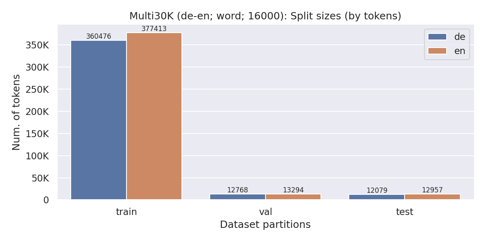

# AutoNLP

AutoNLP is a library to build seq2seq models with almost no-code, so that you can remain focused on your research.

**What do we offer?**
- Toolkit abstraction
- Automatic and replicable experimentation in grid for seq2seq models.
  - Automatic dataset preprocessing
  - Automatic training, fine-tuning and scoring
  - Automatic logging, reporting, plotting and statistics of the datasets and models

Despite our no-code approach, all the control remains in the user since all the intermediate steps (pretokenization, 
subword encodings, split sizes...) are:
- Saved in separated folders so that the user can inspect any part of the process (and reuse it)
- Produced using standard libraries (moses, sentencepiece, sacrebleu,...) that you can replicate via the command line.


## Installation

```
git clone git@github.com:salvacarrion/autonlp.git
cd autonlp
pip install -e .
```


## Usage

### Dataset generation

The `DatasetBuilder` is the object in charge of generating versions of your dataset from a reference one ("original"). If you don't know how to use it, 
run this code with `interactive=True` and it will guide you step-by-step to generate the reference dataset.

```python
from autonlp import DatasetBuilder

# Create datasets for training (2*1*2*3*2 = 24 datasets)
tr_datasets = DatasetBuilder(
    base_path="/home/salva/datasets",
    datasets=[
        {"name": "scielo/biological", "languages": ["de-en"], "sizes": [("original", None), ("100k", 100000)]},
        {"name": "scielo/health", "languages": ["de-en"], "sizes": [("original", None), ("100k", 100000)]},
    ],
    subword_models=["word", "unigram", "char"],
    vocab_sizes=[8000, 16000],
).build(make_plots=True, safe=True)

# Create datasets for testing
ts_datasets = tr_datasets
```


### Train & Score

The `Translator` object abstracts the seq2seq pipeline so that you can train and score your custom models effortless. Similarly, 
you can use other engines such as `fairseq` or `opennmt`.

```python
import autonlp as al

# Train & Score a model for each dataset
for train_ds in tr_datasets:
    model = al.Translator()
    model.fit(train_ds)
    model.predict(ts_datasets, metrics={"bleu", "chrf", "bertscore", "comet"}, beams=[1, 5])
```

### Generate a report

```python
from autonlp.tasks.translation.metrics import create_report

# Train & Score a model for each dataset
scores = {}
for train_ds in tr_datasets:
    model = al.Translator()
    model.fit(train_ds)
    m_scores = model.predict(ts_datasets, metrics={"bleu"}, beams=[5])
    scores[str(train_ds)] = m_scores

# Make report
create_report(metrics=scores, metric_id="beam_5__sacrebleu_bleu", output_path=".outputs")
```

### Toolkit abstraction

#### Custom models

To create your custom pytorch model, you only need inherit from `Seq2Seq` and then pass it as parameter to the `Translator` class.

```python
from autonlp.tasks.translation import Seq2Seq

class Transformer(Seq2Seq):
    def __init__(self, *args, **kwargs):
        super().__init__()
        # Your model        

    def forward(self, X, Y):
        return output  # (Batch, Length, probabilities)

    
# Train & Score a model for each dataset
for train_ds in tr_datasets:
    model = al.Translator(model=Transformer)
    model.fit(train_ds)
    model.predict(ts_datasets, metrics={"bleu"}, beams=[5])
```


#### Fairseq models

```text
fairseq_args = [
    "--arch transformer",
    "--encoder-embed-dim 256",
    "--decoder-embed-dim 256",
    "--encoder-layers 3",
    "--decoder-layers 3",
    "--encoder-attention-heads 8",
    "--decoder-attention-heads 8",
    "--encoder-ffn-embed-dim 512",
    "--decoder-ffn-embed-dim 512",
    "--dropout 0.1",
]

# Train fairseq models
for train_ds in tr_datasets:
    model = al.FairseqTranslator(conda_env_name="fairseq")
    model.fit(train_ds, fairseq_args=fairseq_args)
    model.predict(ts_datasets, metrics={"bleu"}, beams=[1, 5])
```


### Plots & Stats

AutoNLP will automatically generate plots for the split sizes, the sentence length distributions, 
token frequencies, the evaluated models, etc. All these plots can be found along with either a .json or a .csv 
containing its data, summary and statistics





### Layout example

This is an example of the typical layout that the DatasetBuilder generates: (complete tree [here](docs/data/tree.txt)
```text
multi30k/
.
├── original
│   └── de-en
│       ├── data
│       │   ├── encoded
│       │   │   ├── char
│       │   │   │   └── 16000
│       │   │   │       ├── test.de
│       │   │   │       ├── test.en
│       │   │   │       ├── train.de
│       │   │   │       ├── train.en
│       │   │   │       ├── val.de
│       │   │   │       └── val.en
│       │   │   ├── unigram
│       │   │   │   └── 16000
│       │   │   │       ├── test.de
│       │   │   │       ├── test.en
│       │   │   │       ├── train.de
│       │   │   │       ├── train.en
│       │   │   │       ├── val.de
│       │   │   │       └── val.en
│       │   │   └── word
│       │   │       └── 16000
│       │   │           ├── test.de
│       │   │           ├── test.en
│       │   │           ├── train.de
│       │   │           ├── train.en
│       │   │           ├── val.de
│       │   │           └── val.en
│       │   ├── pretokenized
│       │   │   ├── test.de
│       │   │   ├── test.en
│       │   │   ├── train.de
│       │   │   ├── train.en
│       │   │   ├── val.de
│       │   │   └── val.en
│       │   ├── raw
│       │   │   ├── data.de
│       │   │   └── data.en
│       │   └── splits
│       │       ├── test.de
│       │       ├── test.en
│       │       ├── train.de
│       │       ├── train.en
│       │       ├── val.de
│       │       └── val.en
│       ├── models
...
```