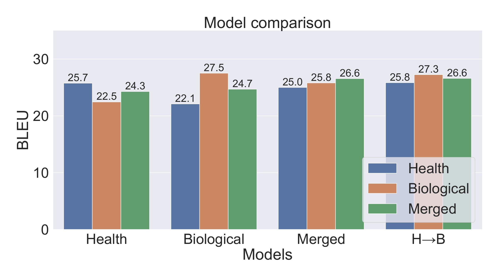
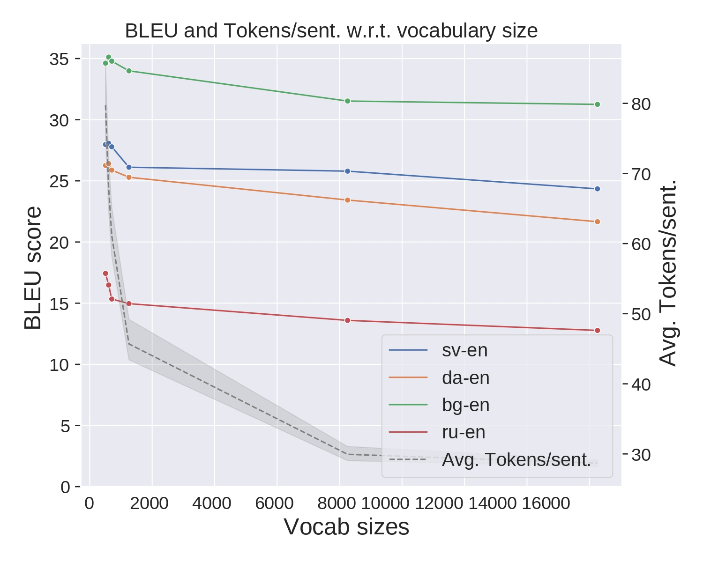
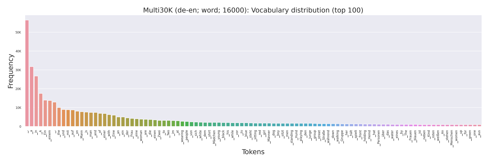

<div align="center">


**A framework for automating grid experimentation in neural machine translation.**

[](https://github.com/salvacarrion/autonmt/actions/workflows/python-package.yml)
[](LICENSE)
[](https://github.com/salvacarrion/autonmt/releases)
[](pyproject.toml)

[Quickstart](#quickstart) • [Installation](#installation) • [Examples](examples) • [Architecture](#architecture) • [Reports](#reports)

</div>

---

AutoNMT automates the boring half of seq2seq research (i.e., tokenization, training, scoring, logging, plotting, file management) so you can focus on the model. Define a grid of datasets × language pairs × subword models × vocab sizes, and AutoNMT runs the cross product, stores every intermediate artifact on disk, and produces a single comparable report at the end.

The same script can train AutoNMT's own PyTorch Lightning models or shell out to Fairseq - switch backends by changing one class.

## Quickstart

Fetch a dataset from HuggingFace, train a small Transformer, and print the BLEU score - all in one script:

```bash
pip install -e .
pip install -e '.[hf]'             # optional, for the HuggingFace loader
python examples/0_quickstart_hf.py
```

```python
from autonmt.datasets import DatasetBuilder
from autonmt.datasets.hf_loader import download_hf_dataset
from autonmt.backends import AutonmtTranslator
from autonmt.backends.base.config import FitConfig, PredictConfig
from autonmt.core.models import Transformer
from autonmt.vocabularies import Vocabulary

# 1. Pull multi30k from HuggingFace into AutoNMT's on-disk layout
download_hf_dataset(
    hf_id="bentrevett/multi30k", base_path="datasets/quickstart",
    dataset_name="multi30k", lang_pair="de-en", src_field="de", trg_field="en",
)

# 2. Preprocess + train SentencePiece BPE-4000
builder = DatasetBuilder(
    base_path="datasets/quickstart",
    datasets=[{"name": "multi30k", "languages": ["de-en"], "sizes": [("original", None)]}],
    encoding=[{"subword_models": ["bpe"], "vocab_sizes": [4000]}],
).build()

# 3. Train + score
train_ds = builder.get_train_ds()[0]
src_vocab = Vocabulary(max_tokens=150).build_from_ds(ds=train_ds, lang=train_ds.src_lang)
trg_vocab = Vocabulary(max_tokens=150).build_from_ds(ds=train_ds, lang=train_ds.trg_lang)

trainer = AutonmtTranslator(
    model=Transformer(len(src_vocab), len(trg_vocab), padding_idx=src_vocab.pad_id),
    src_vocab=src_vocab, trg_vocab=trg_vocab,
    runs_dir=train_ds.get_runs_path("autonmt"),
    run_name=train_ds.get_run_name("quickstart"),
)
trainer.fit(train_ds, config=FitConfig(max_epochs=3, batch_size=128))
scores = trainer.predict(builder.get_test_ds(), config=PredictConfig(metrics={"bleu"}))
```

See [`examples/`](examples) for a custom-model grid, a Fairseq variant, and a plotting recipe.

## Installation

Requires Python 3.8+. CI tests against 3.11; other 3.x versions should work but are not actively verified.

### Pip (editable)

```bash
git clone https://github.com/salvacarrion/autonmt.git
cd autonmt/
pip install -e .
```

### Docker

```bash
git clone https://github.com/salvacarrion/autonmt.git
cd autonmt/
docker build -t autonmt:latest .
docker run --gpus all -d -v "$PWD":/autonmt --name autonmt_container autonmt:latest
docker exec -it autonmt_container bash
```

### Optional dependencies

| Package                  | Install                       | Used for                                                                                             |
| ------------------------ | ----------------------------- | ---------------------------------------------------------------------------------------------------- |
| `datasets`, `evaluate`   | `pip install -e '.[hf]'`      | `hf_loader.download_hf_dataset()`                                                                    |
| `wandb`                  | `pip install -e '.[wandb]'`   | Training logger (`wandb_params=` kwarg on `fit()`)                                                   |
| `comet_ml`               | `pip install -e '.[comet]'`   | Training logger (`comet_params=` kwarg on `fit()`)                                                   |
| `fairseq` _(deprecated)_ | `pip install -e '.[fairseq]'` | `FairseqTranslator` backend - fairseq was archived 2026-03-20, kept for backwards compatibility only |
| _(everything above)_     | `pip install -e '.[all]'`     | One-shot install of every extra                                                                      |

## Architecture

The pipeline is three composable layers: **dataset variants → translator → report**.

```
DatasetBuilder  ───►  BaseTranslator  ───►  generate_report
   (grid)              (fit / predict)         (json + csv + plots)
                            │
                ┌───────────┴───────────┐
                ▼                       ▼
        AutonmtTranslator       FairseqTranslator
       (Lightning models)         (fairseq CLI)
```

- **`DatasetBuilder`** ([`datasets/dataset_builder.py`](autonmt/datasets/dataset_builder.py)) unrolls the declared cross-product of datasets × language pairs × sizes × subword models × vocab sizes, runs cleanup, trains SentencePiece, and materialises every variant on disk. Each encoding entry also accepts `byte_fallback: bool` (default `False`) to enable SentencePiece byte fallback for that model - declare separate entries to compare `bpe` with and without it. The flag is orthogonal to `subword_models`. As a shorthand, suffixing the model name with `+bytes` (e.g. `"bpe+bytes"`) is equivalent to setting `byte_fallback=True` for that model.
- **`BaseTranslator`** ([`backends/base/translator.py`](autonmt/backends/base/translator.py)) defines the shared `fit()` / `predict()` pipeline. Subclasses implement `_preprocess`, `_train`, `_translate`.
- **`generate_report`** ([`reporting/report.py`](autonmt/reporting/report.py)) flattens the per-run score dicts into a single CSV + comparison plots.

### Typed configuration (optional)

`fit()` and `predict()` accept either keyword arguments or a typed config object:

```python
from autonmt.backends.base.config import FitConfig, PredictConfig

# Equivalent forms
trainer.fit(train_ds, batch_size=64, max_epochs=10)
trainer.fit(train_ds, config=FitConfig(batch_size=64, max_epochs=10))

# Explicit kwargs override the config on a per-key basis
trainer.fit(train_ds, config=FitConfig(batch_size=64), max_epochs=20)
```

Toolkit-specific extras (`wandb_params`, `fairseq_args`, `strategy`, …) pass through `**kwargs` untouched - they're forwarded to the underlying backend.

## On-disk layout

Every artifact lives under `base_path/<dataset>/<lang-pair>/<size>/`:

```text
multi30k/de-en/original/
├── data/
│   ├── 0_raw/                       data.de, data.en
│   ├── 1_splits/                    train|val|test.{de,en}
│   ├── 2_preprocessed/              normalised splits
│   ├── 3_pretokenized/              moses-tokenised (subword=word only)
│   └── 4_encoded/<subword>/<vocab>/ SentencePiece-encoded splits
├── vocabs/<subword>/<vocab>/        SentencePiece .model + .vocab
├── stats/<subword>/<vocab>/         per-split token statistics
├── plots/<subword>/<vocab>/         length / frequency plots
└── models/<toolkit>/runs/<run>/
    ├── checkpoints/                 *.pt
    ├── eval/<eval_ds>/              decoded src/ref/hyp + per-metric scores
    └── logs/                        config_train.json, config_predict.json, TB / wandb / comet
```

When `byte_fallback=True`, the `<subword>` segment becomes `<model>+bytes` (e.g. `bpe+bytes/8000`), so runs with and without fallback never collide on disk.

Each stage checks `force_overwrite` before rewriting, so re-running an experiment skips completed stages. When debugging a stage, delete only that stage's directory - not the whole tree.

See [`docs/data/tree.txt`](docs/data/tree.txt) for a full example tree.

## Examples

| File                                                         | What it does                                                                                                    |
| ------------------------------------------------------------ | --------------------------------------------------------------------------------------------------------------- |
| [`examples/0_quickstart_hf.py`](examples/0_quickstart_hf.py) | HF dataset → train → BLEU. The smallest end-to-end script.                                                      |
| [`examples/1_custom_model.py`](examples/1_custom_model.py)   | Grid: europarl × {es,fr,de}-en × {bpe, unigram (byte-fallback), char (±byte-fallback), bytes} × {8k, 16k, 32k}. |
| [`examples/2_fairseq_model.py`](examples/2_fairseq_model.py) | Same shape via the Fairseq backend _(deprecated - fairseq is archived)_.                                        |
| [`examples/3_plot_results.py`](examples/3_plot_results.py)   | Read stats from disk and produce multi-variable plots.                                                          |

## Custom models

Inherit from `LitSeq2Seq` and implement `forward_encoder`, `forward_decoder`, and `forward_enc_dec`. Logits must come out shaped `(batch, length, vocab)`.

```python
from autonmt.core.seq2seq import LitSeq2Seq

class MyModel(LitSeq2Seq):
    def __init__(self, src_vocab_size, trg_vocab_size, padding_idx, **kwargs):
        super().__init__(src_vocab_size, trg_vocab_size, padding_idx, **kwargs)

    def forward_encoder(self, x, x_len, **kwargs): ...
    def forward_decoder(self, y, y_len, states, **kwargs): ...
    def forward_enc_dec(self, x, x_len, y, y_len, **kwargs): ...
```

Then pass it to `AutonmtTranslator(model=MyModel(...), ...)`.

## External toolkits (Fairseq) - _deprecated_

> ⚠️ **Deprecated.** Fairseq was [archived by its maintainers on 2026-03-20](https://github.com/facebookresearch/fairseq)
> and no longer receives updates. `FairseqTranslator` is kept working for users with
> existing installs, but new projects should use `AutonmtTranslator` (PyTorch Lightning).
> Importing the module emits a `DeprecationWarning`; instantiating without `fairseq`
> installed raises `ImportError` with install instructions.

`FairseqTranslator` shells out to the Fairseq CLI. AutoNMT translates kwargs (`max_epochs`, `batch_size`, …) to Fairseq flags via an internal table.

```python
from autonmt.backends.fairseq.translator import FairseqTranslator  # DeprecationWarning here
from autonmt.vocabularies import Vocabulary

# Vocabs are needed so the base translator can encode eval splits with the
# same subword model the training run used.
src_vocab = Vocabulary().build_from_ds(ds=train_ds, lang=train_ds.src_lang)
trg_vocab = Vocabulary().build_from_ds(ds=train_ds, lang=train_ds.trg_lang)

trainer = FairseqTranslator(
    src_vocab=src_vocab, trg_vocab=trg_vocab,
    runs_dir=..., run_name=...,
)
trainer.fit(
    train_ds,
    config=FitConfig(max_epochs=5, batch_size=128),
    fairseq_args=["--arch transformer", "--dropout 0.1", ...],
)
```

> **Precedence:** on collision, `fairseq_args` ALWAYS win over AutoNMT kwargs. If you
> set `max_epochs=10` and `--max-epoch 15` in `fairseq_args`, the run uses 15. This is
> intentional: it lets you express anything Fairseq supports without AutoNMT having to
> know about it.

## Reports

```python
from autonmt.reporting.report import generate_report

df_report, df_summary = generate_report(
    scores=scores, output_path="outputs/run1",
    plot_metric="translations.beam1.sacrebleu_bleu_score",
)
print(df_summary.to_string(index=False))
```

Output (truncated — `df_summary` keeps the identifying columns plus every column matching `ref_metric`, default `"bleu"`):

```text
train_dataset  train__lang_pair  test_dataset  test__lang_pair  vocab__subword_model  vocab__size  model__architecture  model__total_params  translations.beam1.sacrebleu_bleu_score
multi30k                  de-en      multi30k            de-en               unigram         4000          transformer              7654321                                35.123375
multi30k                  de-en      multi30k            de-en                  word         4000          transformer              7800000                                34.706139
```

Score keys are flattened as `translations.beam<n>.<tool>_<metric>_<field>` - e.g. `translations.beam1.sacrebleu_bleu_score`, `translations.beam5.bertscore_f1_mean`. The full per-run dict is also dumped as `reports/report.json` / `reports/report.csv` next to the summary.

### Plots

| Model comparison                             | Avg. tokens vs BLEU                                     | Vocabulary distribution                                                                    |
| -------------------------------------------- | ------------------------------------------------------- | ------------------------------------------------------------------------------------------ |
|  |  |  |

## Reproducibility

- All intermediate artifacts are persisted in numbered stage folders, so you can inspect, reuse, or pin any step.
- Every run dumps its full effective config to `logs/config_{train,predict}.json`.
- `manual_seed(seed)` seeds Python `random`, NumPy, Torch and Lightning together. Pass `seed=` to `fit()` for deterministic runs.
- Backed by widely-used reference libraries (SentencePiece, sacreBLEU, Moses, COMET, BERTScore) so results are comparable across papers.

## Logging

AutoNMT uses Python's `logging` module under the `autonmt` namespace. Set the level via the env var or programmatically:

```bash
AUTONMT_LOG_LEVEL=DEBUG python my_script.py
```

```python
import logging
logging.getLogger("autonmt").setLevel("WARNING")
```

## Development

```bash
pip install -e .
pytest tests/                                                 # run the test suite
flake8 . --count --select=E9,F63,F7,F82 --show-source         # the only lint that breaks CI
```

The synthetic-corpus E2E test in [`tests/functional/test_builder_e2e.py`](tests/functional/test_builder_e2e.py) exercises the full preprocessing pipeline (raw → splits → SentencePiece → encoded) in under 2 seconds - useful for verifying refactors without spinning up a GPU.

## License

[MIT](LICENSE) © Salva Carrión.
