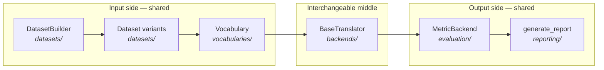
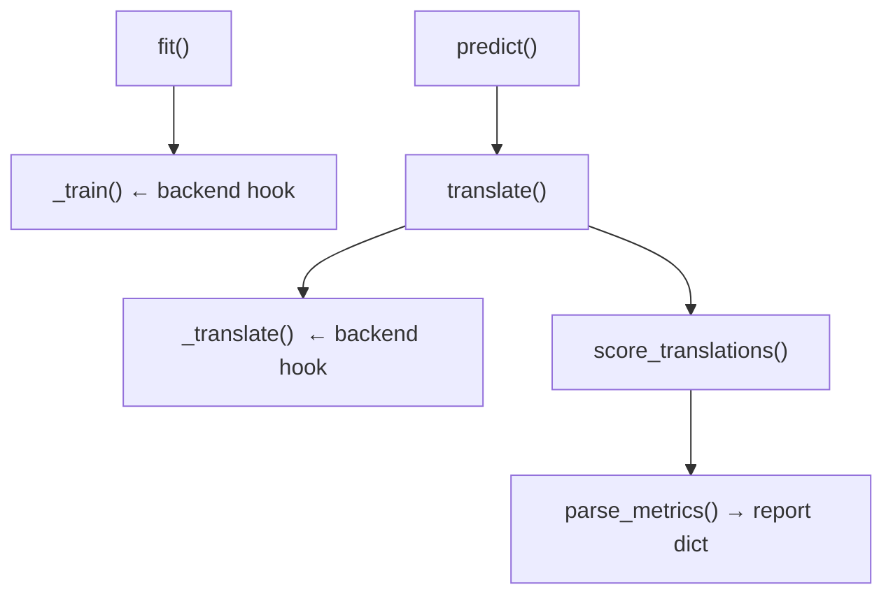

# Building blocks & the pipeline

The [mental model](../introduction/mental-model.md) gave you the one-line story: *a grid
becomes dataset variants, variants flow through a translator, the translator's scores
become a report.* This page zooms in on the **pieces** that implement that story and how
they compose, so you know what each part owns before you dive into any of them.

## The pipeline, with names attached



Three groups, mapping exactly to how the documentation is organized:

- **Input side (shared):** [`datasets/`](../data/dataset-builder.md) and
  [`vocabularies/`](../data/vocabularies.md) turn raw text into encoded splits + vocab
  artifacts. Backend-independent.
- **Interchangeable middle:** [`backends/`](../backends/index.md) — a translator wraps a
  toolkit (AutoNMT/Lightning, HuggingFace, Fairseq) behind one interface. **This is the
  only part that swaps.**
- **Output side (shared):** [`evaluation/`](../evaluation/metrics.md) and
  [`reporting/`](../evaluation/reports.md) score translations and assemble the report.
  Backend-independent.

## What each package owns

| Package          | Role | Key types |
| ---------------- | ---- | --------- |
| `datasets/`      | Corpus prep: unroll the grid, clean/split/encode, compute paths | `DatasetBuilder`, `Dataset`, `preprocessing`, `encoding` |
| `vocabularies/`  | Vocab artifacts and lookup | `Vocabulary`, `BaseVocabulary`, `vocab_builder` |
| `backends/`      | The translator contract + concrete toolkits | `BaseTranslator`, `AutonmtTranslator`, `HuggingFaceTranslator`, `FairseqTranslator` |
| `core/`          | AutoNMT's native neural engine | `LitSeq2Seq`, `nn/models`, `decoding/`, `samplers/`, `TranslationDataset` |
| `evaluation/`    | Metric backends + significance | `MetricBackend`, `METRIC_BACKENDS`, `paired_bootstrap_bleu` |
| `reporting/`     | Report orchestration + figures | `generate_report`, `figures`, `plots` |
| `utils/`         | Generic helpers | `fileio`, `logger`, `seed`, `enums` |

A useful distinction: **`backends/` is the abstraction; `core/` is one implementation of
it.** The native `AutonmtTranslator` (in `backends/autonmt/`) drives the engine in `core/`.
The HuggingFace and Fairseq translators implement the same contract against *their*
toolkits and never touch `core/`. That's why the docs give `core/` its own deep chapter
([The AutoNMT toolkit](../toolkit/overview.md)) while HuggingFace and Fairseq are single
[backend pages](../backends/index.md) — depth follows ownership.

## The three composable layers

### 1 · `DatasetBuilder` — the grid unroller

[`DatasetBuilder`](../data/dataset-builder.md) takes your declaration (datasets × language
pairs × sizes × subword models × vocab sizes), computes the cross-product, and turns each
cell into a `Dataset`. It runs the data stages on disk and exposes the variant lists your
loop iterates:

```python
builder = DatasetBuilder(base_path="data", datasets=[...], encoding=[...]).build()
builder.get_train_ds()   # → list[Dataset], the cells to train on
builder.get_test_ds()    # → list[Dataset], the cells to evaluate on
```

A `Dataset` is a **path/identity object**, not a torch dataset — it answers "where do my
encoded files / vocab / checkpoints live?" for one cell. (The torch `Dataset` used during
training is a different class, [`TranslationDataset`](../toolkit/data-pipeline.md).)

### 2 · `BaseTranslator` — the experiment surface

Every backend is a [`BaseTranslator`](toolkit-abstraction.md). Its public surface is just
`fit()` and `predict()`; internally those call backend-specific hooks. You instantiate the
concrete subclass for the toolkit you want, then drive it with the two verbs:

```python
trainer = AutonmtTranslator.from_dataset(train_ds, model=..., src_vocab=..., tgt_vocab=..., run_prefix="x")
trainer.fit(train_ds, config=FitConfig(...))
scores = trainer.predict(builder.get_test_ds(), config=PredictConfig(...))
```

### 3 · `generate_report` — the comparable output

`predict()` returns score dicts; [`generate_report`](../evaluation/reports.md) flattens the
list into a DataFrame, writes JSON/CSV, and (optionally) plots a comparison across runs.

## How a backend plugs in (the short version)

Each translator implements the same lifecycle but fills in the toolkit-specific blanks:



`fit()` / `predict()` (shared) own config resolution, persistence, path computation, eval
filtering, scoring, and report assembly. `_train` / `_translate` (per-backend) own the bit
that's genuinely toolkit-specific: run a Lightning trainer, call `model.generate`, or shell
out to a CLI. The next page, [The toolkit abstraction](toolkit-abstraction.md), opens that
contract up.

---

Continue to **[The toolkit abstraction](toolkit-abstraction.md)** for the contract that
makes backends interchangeable, or **[On-disk layout &
reproducibility](layout-and-reproducibility.md)** for where everything lands.
