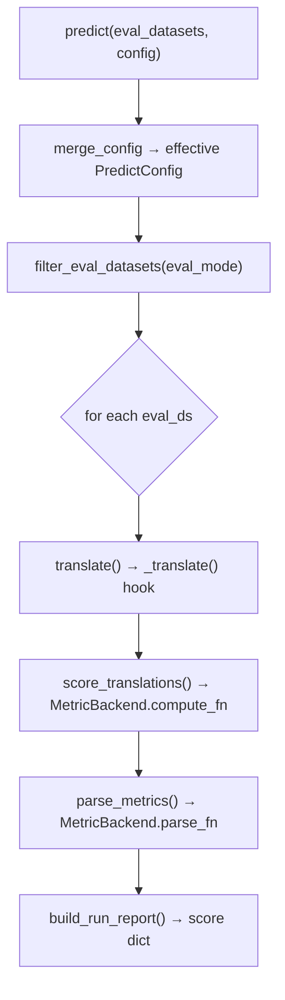

# The toolkit abstraction

This is the idea that lets the *same* experiment script run on different NMT toolkits — the
["Keras for backends"](../introduction/philosophy.md#keras) principle, made concrete. If you
understand the contract on this page, you understand why swapping `AutonmtTranslator` for
`HuggingFaceTranslator` is a one-line change.

## One contract: `BaseTranslator`

Every backend subclasses
[`BaseTranslator`](../reference/backends.md#autonmt.backends._base.translation_engine.BaseTranslator).
It defines the whole experiment lifecycle once, in shared code, and delegates only the
genuinely toolkit-specific steps to abstract hooks.

The **public surface** is two methods:

```python
trainer.fit(train_ds, config=FitConfig(...))        # train / fine-tune
trainer.predict(eval_datasets, config=PredictConfig(...))  # translate + score → scores
```

The **backend hooks** a subclass must (or may) fill in:

| Hook | Required? | Responsibility |
| ---- | --------- | -------------- |
| `_train(train_ds, ...)` | yes | Run the toolkit's training for one variant |
| `_translate(...)` | yes | Produce translations for one (subset, beam) pass |
| `_get_lang_pair() -> (src, tgt)` | yes | Drives eval filtering + the target language handed to metrics |
| `_get_run_metadata() -> RunMetadata` | optional | Model/vocab info for the report (param counts, arch, vocab size) |

Everything else — resolving config, persisting it, computing paths, filtering which test
sets to evaluate, scoring, and assembling the report — lives in `BaseTranslator` and is
**identical across backends**.

## What `fit()` and `predict()` actually do

Both methods follow the same recipe: **resolve config → persist it → dispatch to a hook.**

```python
def fit(self, train_ds, config=None, **kwargs):
    cfg, extra = merge_config(config, FitConfig, kwargs)   # defaults < config < kwargs
    self._add_config("fit", cfg); self._save_config("config_train.json")
    self.train(train_ds, **cfg, **extra)                   # → calls _train()
```

`predict()` does more, because evaluation has more shared structure:



So a backend author writes *only* `_train` and `_translate` (plus `_get_lang_pair`); the
config plumbing, the per-(subset, beam) loop, the metric routing, and the report schema are
free.

!!! note "Config precedence"
    `fit`/`predict` accept either a typed config object ([`FitConfig`](../toolkit/training.md) /
    [`PredictConfig`](../toolkit/predict.md)) **or** loose keyword arguments — and you can mix
    them. The merge order is **defaults < `config=` < explicit kwargs**, per key. Any kwarg
    that isn't a config field is treated as a toolkit-specific extra and forwarded to the
    backend (`strategy=`, `wandb_params=`, `fairseq_args=`, `hf_training_args=`).

## Two translate modes: SPM-pipeline vs direct

The one real divergence between backends is **who owns tokenization during translation**,
and the contract handles it with a single branch.

### SPM-pipeline mode (AutoNMT, Fairseq)

Backends that tokenize with the dataset's SentencePiece model assign a
`SPMTranslatePipeline` in their constructor:

```python
self._spm = SPMTranslatePipeline(layout=..., src_vocab=..., tgt_vocab=..., test_subsets=...)
```

When `_spm` is set, `translate()` delegates the whole **encode → decode → materialize**
round-trip to it. The backend's `_translate` only has to write `hyp.tok` (the tokenized
hypotheses); the pipeline decodes them to `hyp.txt` and fills in `src.txt` / `ref.txt` from
the original preprocessed files (so model-emitted `<unk>`s don't bias the score).

### Direct mode (HuggingFace)

A backend with its **own** tokenizer leaves `_spm = None`. Then `translate()` loops over
`(subset, beam)` and calls `_translate` directly, and the hook writes `src.txt`, `ref.txt`,
`hyp.txt` itself:

```python
# HuggingFaceTranslator: tokenizer/model own the round-trip, so no SPM step.
def _translate(self, *, eval_ds, output_path, beam_width, ...):
    src, ref = self._load_eval_text(eval_ds, ...)
    hyp = self._generate(src, beam=beam_width, ...)   # model.generate(...)
    # write src.txt / ref.txt / hyp.txt
```

Either way, the **output artifacts are identical** (`src.txt` / `ref.txt` / `hyp.txt` under
`eval/<eval_ds>/.../beam<N>/`), so `score_translations` and `parse_metrics` consume them
without caring which mode produced them. That's what keeps the output side of the pipeline
truly shared.

## How the three backends fill the contract

| | `AutonmtTranslator` | `HuggingFaceTranslator` | `FairseqTranslator` |
| --- | --- | --- | --- |
| `ENGINE` (runs path) | `"autonmt"` | `"huggingface"` | `"fairseq"` |
| `_train` | Lightning `Trainer.fit` on a `LitSeq2Seq` | `Seq2SeqTrainer.train()` (fine-tune) | shell out to `fairseq-train` |
| `_translate` | decode via a `BaseSearch` → `hyp.tok` | `model.generate` → `hyp.txt` | `fairseq-generate` → parse `hyp.txt` |
| tokenization | SPM pipeline (`_spm` set) | own HF tokenizer (`_spm = None`) | SPM pipeline (`_spm` set) |
| translate mode | SPM-pipeline | direct | SPM-pipeline |

The lesson: a new backend is a **small** amount of code — implement two or three hooks and
decide your translate mode. Everything that makes results comparable (config capture,
scoring, reporting) you inherit. To actually write one, see [Extending
AutoNMT](../extending/index.md#a-custom-backend).

## `eval_mode`: which test sets get scored

`predict()` doesn't blindly evaluate everything you pass. `filter_eval_datasets` narrows the
list by `eval_mode` (a field of `PredictConfig`):

- `"same"` *(default)* — only test variants the model actually trained on.
- `"compatible"` — any variant with the same language pair.
- `"all"` — every variant you passed.

This matters for grids: you can hand `predict()` the *entire* `get_test_ds()` list and let
each trained model pick out the test sets that are relevant to it.

---

Next: **[On-disk layout & reproducibility](layout-and-reproducibility.md)** — where all
these artifacts land and why re-runs are cheap.
