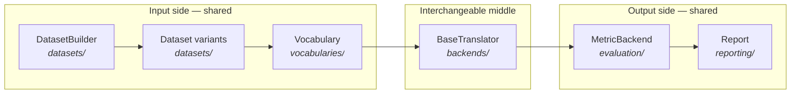
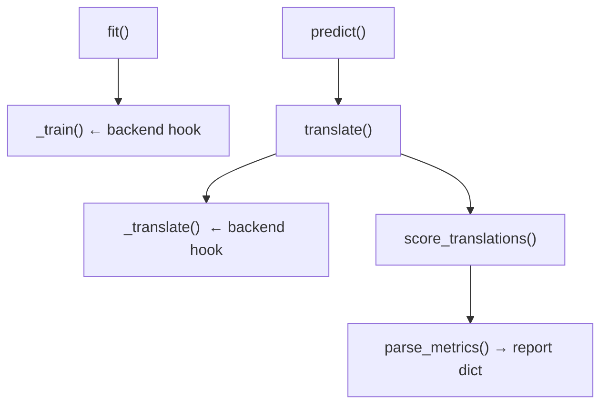

# Architecture

The [mental model](mental-model.md) gave you the one-line story: *a grid becomes dataset
variants, variants flow through a translator, the translator's scores become a report.* This
page names the **pieces** that implement that story and how they compose — the structural
view behind the pipeline.

AutoNMT is a **research orchestration framework**, not a model zoo or a new deep-learning
library. It *owns* the pipeline (data prep, tokenization, the train/decode loop, scoring,
reporting), *ships* a small readable neural engine so you can run end to end out of the box,
but *doesn't lock you* to that engine or try to be exhaustive — anything specialized is a
[subclass or hook](philosophy.md#extensible), not a built-in flag.

## The pipeline, with names attached

Three groups, mapping exactly to how the documentation is organized:

- **Input side (shared):** [`datasets/`](../guide/data/datasets.md) and
  [`vocabularies/`](../guide/data/vocabularies.md) turn raw text into encoded splits + vocab
  artifacts. Backend-independent.
- **Interchangeable middle:** [`backends/`](../guide/backends/choosing.md) — a translator
  wraps a toolkit (AutoNMT/Lightning, HuggingFace, Fairseq) behind one interface. **This is
  the only part that swaps.**
- **Output side (shared):** [`evaluation/`](../guide/evaluation/metrics.md) and
  [`reporting/`](../guide/evaluation/reports.md) score translations and assemble the report.
  Backend-independent.

## What each package owns

| Package          | Role | Key types |
| ---------------- | ---- | --------- |
| `datasets/`      | Corpus prep: unroll the grid, clean/split/encode, compute paths | `DatasetBuilder`, `Dataset`, `preprocessing`, `encoding` |
| `vocabularies/`  | Vocab artifacts and lookup | `Vocabulary`, `BaseVocabulary`, `vocab_builder` |
| `backends/`      | The translator contract + concrete toolkits | `BaseTranslator`, `AutonmtTranslator`, `HuggingFaceTranslator`, `FairseqTranslator` |
| `core/`          | AutoNMT's native neural engine | `LitSeq2Seq`, `nn/models`, `nn/layers`, `decoding/`, `samplers/`, `TranslationDataset` |
| `evaluation/`    | Metric backends + significance | `MetricBackend`, `METRIC_BACKENDS`, `paired_bootstrap_bleu` |
| `reporting/`     | Report classes + plot primitives | `Report`, `DatasetReport`, `schema`, `plots` |
| `utils/`         | Generic helpers | `fileio`, `logger`, `seed`, `enums` |

A useful distinction: **`backends/` is the abstraction; `core/` is one implementation of
it.** The native `AutonmtTranslator` (in `backends/autonmt/`) drives the engine in `core/`.
The HuggingFace and Fairseq translators implement the same contract against *their* toolkits
and never touch `core/`. That's why the User guide treats the native engine in depth
(models, training, decoding) while HuggingFace and Fairseq are single
[backend pages](../guide/backends/choosing.md) — depth follows ownership.

## Composition over inheritance, where it counts

The translator lifecycle is shared by inheritance (every backend subclasses
`BaseTranslator`), but the one genuine divergence — *who owns tokenization during
translation* — is handled by **composition**: a backend that uses the dataset's
SentencePiece model assigns `self._spm = SPMTranslatePipeline(...)`; one with its own
tokenizer (HuggingFace) leaves `_spm = None`. `translate()` branches on that single
attribute. The full contract and the two translate modes are documented in
[Choosing a backend](../guide/backends/choosing.md).

## How a backend plugs in (the short version)

`fit()` / `predict()` (shared) own config resolution, persistence, path computation, eval
filtering, scoring, and report assembly. `_train` / `_translate` (per-backend) own the bit
that's genuinely toolkit-specific: run a Lightning trainer, call `model.generate`, or shell
out to a CLI. A new backend is therefore a *small* amount of code.

---

Continue to **[On-disk layout](on-disk-layout.md)** for where everything lands, then the
**[Reproducibility model](reproducibility.md)** for why re-runs are faithful and cheap.
