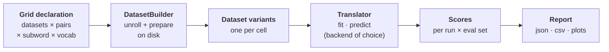

# The mental model

If you remember one diagram from these docs, make it this one.



Everything in AutoNMT is a station on this line. Reading it left to right *is* the mental
model: **a grid becomes dataset variants, variants flow through a translator, and the
translator's scores become a report.**

## The three layers

### 1. The grid → dataset variants

You declare the **axes** of your experiment. The
[`DatasetBuilder`](../guide/data/datasets.md) computes the cross-product and turns each
cell into a [`Dataset`](../guide/data/datasets.md#the-dataset-object) object. A `Dataset`
is not a PyTorch dataset — it's an **identity + a path engine**. Given *(name, language
pair, size, subword model, vocab size)* it knows where every file for that cell lives on
disk, and the builder materializes those files (clean → split → encode → build vocab).

```python
builder = DatasetBuilder(base_path="data", datasets=[...], encoding=[...]).build()
train_variants = builder.get_train_ds()   # list of Dataset, one per cell
test_variants  = builder.get_test_ds()
```

### 2. Dataset variants → translator

A [translator](../guide/backends/choosing.md) is the thing that turns a dataset variant into
a trained model and then into translations. It exposes exactly two verbs:

- **`fit(train_ds, ...)`** — train (or fine-tune) on a variant.
- **`predict(eval_datasets, ...)`** — translate the test set(s) and score the output.

Which translator you instantiate decides *which NMT toolkit* runs underneath — AutoNMT's
own Lightning engine, HuggingFace, or Fairseq — but the two verbs never change. This is
the [Keras-style abstraction](philosophy.md#keras): the loop you write is backend-agnostic.

### 3. Translator → report

`predict()` returns a list of score dicts (one per run × evaluation set). Wrap those in a
[`Report`](../guide/evaluation/reports.md) and you get JSON + CSV summaries and
comparison plots — every cell scored identically, side by side.

## A whole experiment is a flat loop

Because the builder already unrolled the grid, your experiment is **iteration, not
nesting**:

```python
from autonmt.reporting.report import Report

scores = []
for train_ds in builder.get_train_ds():          # one cell of the grid
    src_vocab, tgt_vocab = train_ds.build_vocabs(max_tokens=8000)
    trainer = AutonmtTranslator.from_dataset(
        train_ds,
        model=Transformer.from_vocabs(src_vocab, tgt_vocab),
        src_vocab=src_vocab, tgt_vocab=tgt_vocab,
        run_prefix="sweep",
    )
    trainer.fit(train_ds, config=FitConfig(max_epochs=10))
    scores.append(trainer.predict(builder.get_test_ds(), config=PredictConfig(metrics={"bleu", "chrf"})))

Report.from_runs(scores, output_path="outputs/sweep").save().plot_comparison("bleu", beam=5)
```

No matter how many axes you added to the grid, the loop body is the same. That's the whole
point: **the complexity lives in the declaration, not in your control flow.**

## Why the docs are organized the way they are

The pipeline is also the table of contents. Reading the diagram left to right, the
[User guide](../guide/experiments/workflow.md) walks the same path:

- **Data goes in** → [Data](../guide/data/datasets.md): the builder, preprocessing,
  tokenization, vocabularies.
- **The middle swaps** → [Models](../guide/models/using-a-model.md) /
  [Training](../guide/training/training.md) / [Translation](../guide/translation/generating.md)
  document the native engine, and [Backends](../guide/backends/choosing.md) covers running
  HuggingFace or Fairseq instead. Only this stage changes between backends.
- **Reports come out** → [Evaluation](../guide/evaluation/metrics.md): metrics, significance
  testing, and the report itself.

!!! tip "Input and output are shared; only the toolkit swaps"
    Datasets and vocabularies sit **before** the engine (the input you need first); metrics
    and reports sit **after** it (the output). That ordering mirrors the diagram — and
    reinforces the key idea that input and output are shared while only the toolkit in the
    middle is interchangeable.

---

Ready to run it? Head to **[Get started → Installation](../get-started/installation.md)**.
Want the structural view? Go to **[Architecture](architecture.md)**.
