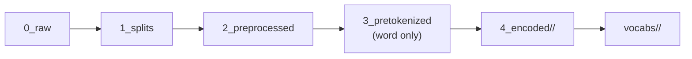

# Datasets & the dataset builder

This is the **input side** of the pipeline. Before any model trains, AutoNMT has to turn
raw parallel text into clean, split, encoded files with matching vocabularies — once per
cell of your grid. The [`DatasetBuilder`](../reference/datasets.md) owns that, and it's
where the [grid-first idea](../introduction/philosophy.md#grid-first) becomes real code.

## Declaring the grid

You describe **two axes groups** — the *data* axes (`datasets`) and the *encoding* axes
(`encoding`) — and the builder takes their cross-product:

```python
from autonmt.datasets import DatasetBuilder

builder = DatasetBuilder(
    base_path="data",
    datasets=[
        {
            "name": "multi30k",
            "languages": ["de-en", "fr-en"],
            "sizes": [("original", None), ("50k", 50000)],
        },
    ],
    encoding=[
        {"subword_models": ["bpe", "unigram"], "vocab_sizes": [4000, 8000]},
    ],
).build()
```

- **`datasets`** — a list of dataset specs. Each has a `name` (the folder under
  `base_path`), `languages` (a list of `"src-tgt"` pairs), and `sizes` (a list of
  `(size_name, n_lines)` tuples; `None` means "use the whole training set").
- **`encoding`** — a list of encoding specs. Each has `subword_models` and `vocab_sizes`.

The example unrolls to **2 language pairs × 2 sizes × 2 subword models × 2 vocab sizes = 16
dataset variants**, materialized on disk under `data/multi30k/<pair>/<size>/…`.

!!! info "Why a 'size' axis?"
    Training-set size is a first-class research variable in MT — low-resource behavior, data
    scaling curves, ablations. `("50k", 50000)` makes a 50 000-line subset of the training
    split that lives in its own folder (`.../50k/`), so the full and reduced versions
    coexist. The `original` size always reads the full corpus.

### Constructor reference

| Argument | Meaning |
| --- | --- |
| `base_path` | Root directory where datasets are read from / written to |
| `datasets` | Data axes: `[{"name", "languages", "sizes"}]` |
| `encoding` | Encoding axes: `[{"subword_models", "vocab_sizes"}]` (optional — omit to only prepare splits) |
| `merge_vocabs` | If `True`, learn one **shared** src+tgt vocabulary instead of two |
| `preprocess_raw_fn` | Callable hook applied to raw files before splitting |
| `preprocess_splits_fn` | Callable hook applied per split after splitting |
| `random_seed` | Seeds the shuffles inside `build()` so builds are reproducible (default `42`) |

The two `preprocess_*` hooks are how you inject custom cleaning — covered in
[Preprocessing & subword encoding](preprocessing-and-encoding.md#hooks).

## What `build()` does

`.build()` runs the data stages for every cell, writing to the [numbered
folders](../architecture/layout-and-reproducibility.md):



Each stage is **skipped if already present** (unless `force_overwrite=True`), so re-running
a grid only builds what's new. Plotting is intentionally *not* part of `build()` — call
`autonmt.reporting.figures.plot_dataset_diagnostics(ds, ...)` afterward if you want
sentence-length and vocab-distribution figures.

## Iterating the variants

After `build()`, the builder hands you the lists your experiment loop walks:

```python
for train_ds in builder.get_train_ds():     # one Dataset per cell
    ...
test_variants = builder.get_test_ds()        # evaluate against these
```

`get_train_ds()` and `get_test_ds()` return the **full cross-product** of `Dataset`
objects (the same list — they're aliases for the variant list, named for how you use them).
You typically train on each in turn and evaluate against the test variants, letting
[`eval_mode`](../toolkit/predict.md#eval-mode) pick the relevant test sets per model.

## The `Dataset` object { #the-dataset-object }

Each cell is a [`Dataset`](../reference/datasets.md#autonmt.datasets.dataset.Dataset). It is
**not** a PyTorch dataset — it's an *identity + path engine*. Given *(name, language pair,
size, subword model, vocab size)* it computes where every file for that cell lives, and
exposes disk-inspection and vocab helpers:

```python
ds = builder.get_train_ds()[0]

ds.src_lang, ds.tgt_lang          # 'de', 'en'
ds.subword_model, ds.vocab_size   # SubwordModel.BPE, '4000'
ds.variant_id(as_path=True)       # 'multi30k/de-en/original/bpe/4000'

ds.get_encoded_path("train.de")   # → .../data/4_encoded/bpe/4000/train.de
ds.get_vocab_path()               # → .../vocabs/bpe/4000/
ds.build_vocabs(max_tokens=8000)  # → (src_vocab, tgt_vocab)
```

Because the `Dataset` knows its own paths, the rest of the framework never does string
surgery on directories — you pass the object around and ask it where things are. (The torch
`Dataset` used at train time is a separate class,
[`TranslationDataset`](../toolkit/data-pipeline.md), built from these paths.)

### Building vocabularies

```python
src_vocab, tgt_vocab = train_ds.build_vocabs(max_tokens=8000)
```

`build_vocabs` returns the source and target [`Vocabulary`](vocabularies.md) objects for the
cell. With `merge_vocabs=True` on the builder, both returned values are the *same* shared
vocabulary instance — so `src_vocab, tgt_vocab = ...` still works without special-casing.
`max_tokens` caps how many tokens a single sentence contributes during batch encoding.

## Bring your own data { #bring-your-own-data }

The builder reads from disk; how the files *got* there is up to you. Two common paths:

### From the HuggingFace Hub

With the `hf` extra installed, `download_hf_dataset` writes a Hub corpus straight into the
AutoNMT layout:

```python
from autonmt.datasets.hf_loader import download_hf_dataset

download_hf_dataset(
    hf_id="bentrevett/multi30k", base_path="data",
    dataset_name="multi30k", lang_pair="de-en",
    src_field="de", tgt_field="en",
    # split_map={"train": "train", "val": "validation", "test": "test"},  # if names differ
    # max_train_lines=50000,  # truncate for smoke tests
)
```

It handles both flat columns and the nested `{"translation": {"de": ..., "en": ...}}`
convention used by most MT datasets (pass the leaf key as `src_field`/`tgt_field`).

### From your own files

Place pre-split files in the splits folder using the language-as-extension convention, then
point the builder at the parent:

```text
data/mycorpus/es-en/original/data/1_splits/
├── train.es   train.en
├── val.es     val.en
└── test.es    test.en
```

```python
builder = DatasetBuilder(
    base_path="data",
    datasets=[{"name": "mycorpus", "languages": ["es-en"], "sizes": [("original", None)]}],
    encoding=[{"subword_models": ["bpe"], "vocab_sizes": [8000]}],
).build()
```

If you only have a single raw file pair (not yet split), put them in `0_raw/` instead and
the builder will create the splits for you.

!!! tip "Check for train/test leakage"
    Sentences that appear in both train and test silently inflate scores — common with
    web-scraped or accidentally-overlapping corpora. AutoNMT ships a cheap checker:
    ```python
    from autonmt.datasets.leakage import warn_on_leakage
    warn_on_leakage(train_lines, test_lines, key_fn=str.lower, label="es-en tgt")
    ```
    It only *logs* the overlaps and returns the list — you decide whether to filter, abort,
    or ignore. Worth the few milliseconds before spending GPU hours.

---

Next: how the text is actually cleaned and split into subwords —
**[Preprocessing & subword encoding](preprocessing-and-encoding.md)** — then
**[Vocabularies](vocabularies.md)**.
