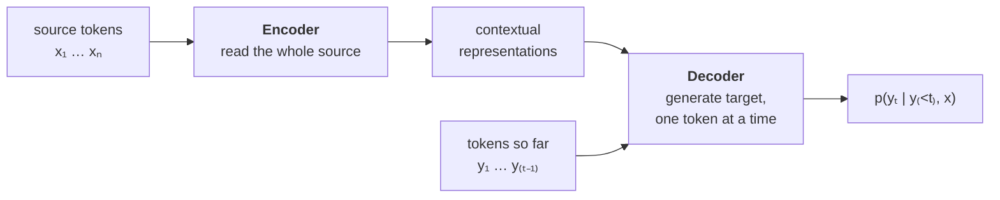

# How NMT works

This page is a **10-minute, first-principles tour** of neural machine translation (NMT):
what problem it solves, the pieces that solve it, and how they fit together. It's written
for readers who can train a model but haven't spent years inside MT — so every other page in
these docs can stay focused and link *back here* for the big picture.

!!! tip "Already fluent in NMT?"
    Skip straight to [Installation](installation.md) or the
    [Quickstart](quickstart.md). Come back if a later page references a concept you'd like
    re-grounded — each section below is the anchor those pages point to.

## The problem: translation as conditional sequence modeling

You're given a sentence in a **source** language, $x = (x_1, \dots, x_n)$, and you want a
sentence in a **target** language, $y = (y_1, \dots, y_m)$. There is no single correct
translation and the lengths don't match, so we don't learn a fixed mapping. Instead we model
a **probability distribution over target sentences given the source**:

$$
p(y \mid x)
$$

A good model puts high probability on fluent, faithful translations and low probability on
the rest. Because a sentence is a sequence, we factor that distribution **one token at a
time**, each token conditioned on the source *and* everything generated so far:

$$
p(y \mid x) = \prod_{t=1}^{m} p(y_t \mid y_{<t}, x)
$$

This single equation drives everything else on this page. **Training** fits the per-token
distribution $p(y_t \mid y_{<t}, x)$; **decoding** searches it for a good $y$;
**evaluation** checks how close that $y$ lands to a human reference. The architecture in the
middle — the encoder–decoder — is just a way to *compute* that distribution.

This autoregressive, attention-based formulation is the one introduced by
[Sutskever et al. (2014)](https://arxiv.org/abs/1409.3215) and
[Bahdanau et al. (2015)](https://arxiv.org/abs/1409.0473), and refined into the Transformer
by [Vaswani et al. (2017)](https://arxiv.org/abs/1706.03762).

## Tokens: what the model actually reads

Models don't see characters or words — they see **token ids**, integers into a fixed
**vocabulary**. So the first question is: what is a token?

- **Words** are intuitive but brittle: any word missing from the vocabulary becomes an
  unknown (`<unk>`), and you'd need an enormous vocabulary to cover real text.
- **Characters** never go out-of-vocabulary, but they make sequences very long, so the model
  has to learn long-range structure from scratch.
- **Subwords** are the standard compromise: frequent words stay whole, rare words split into
  reusable pieces (`translation` → `transl` + `ation`). Nothing is ever truly unknown, and
  sequences stay short. **Byte-Pair Encoding** ([Sennrich et al. (2016)](https://arxiv.org/abs/1508.07909))
  and the **unigram LM** model ([Kudo (2018)](https://arxiv.org/abs/1804.10959)) are the two
  dominant subword schemes; AutoNMT exposes both.

The set of token ids the model can read and write is the **vocabulary**, and its size is a
real hyper-parameter: too small and you over-split rare words; too large and the embedding
table and softmax get expensive.

→ In AutoNMT this is the **data** stage: [Subword tokenization](../guide/data/tokenization.md)
and [Vocabularies](../guide/data/vocabularies.md).

## The architecture: encoder → decoder

To compute $p(y_t \mid y_{<t}, x)$ we use two cooperating networks.

- The **encoder** reads the entire source at once and turns it into a sequence of
  context-aware vectors — each source token's representation is informed by all the others.
- The **decoder** generates the target left to right. At step $t$ it looks at the tokens it
  has produced so far *and* at the encoder's representations, and emits a distribution over
  the vocabulary for the next token.

### Attention: the link between them

The decoder can't treat the source as one fixed summary vector — that loses information for
long sentences. **Attention** lets each decoding step look back at *all* source positions and
weight them by relevance. Given a query $Q$ (what the decoder wants now) and keys/values
$K, V$ (the source representations), scaled dot-product attention is:

$$
\text{Attention}(Q, K, V) = \text{softmax}\!\left(\frac{QK^\top}{\sqrt{d_k}}\right) V
$$

The softmax produces weights that sum to one — a soft, differentiable "look-up" over the
source. The Transformer ([Vaswani et al. (2017)](https://arxiv.org/abs/1706.03762)) builds
the *entire* model out of this operation — source-to-source (self-attention), target-to-target
(masked self-attention), and target-to-source (cross-attention) — which is why it both
trains in parallel and translates well.

→ In AutoNMT these are the **model** pages: [Building blocks](../guide/models/building-blocks.md)
(layers, attention, the incremental decoder) and the [Model catalog](../guide/models/catalog.md)
(Transformer, RNN, convolutional).

## Training: teacher forcing and cross-entropy

We have a parallel corpus of (source, reference-translation) pairs. We want the model to
assign high probability to the reference. Equivalently, we **minimize the negative
log-likelihood** of each reference token — the cross-entropy loss:

$$
\mathcal{L} = -\sum_{t=1}^{m} \log p(y_t \mid y_{<t}, x)
$$

During training the prefix $y_{<t}$ is the **true** reference prefix, not the model's own
guesses — this is **teacher forcing**, and it's what lets the whole target sequence be scored
in one parallel pass. (At inference there is no reference, so the model must feed its own
outputs back in — the mismatch that decoding has to manage.)

Two practical levers fall out of this:

- **Batching.** Sentences have different lengths, so a batch is padded to its longest member;
  padding is wasted compute. Grouping sentences of similar length (**bucketing**) cuts that
  waste. → [Bucketing & batching](../guide/training/bucketing.md).
- **When to stop.** We watch the loss on a held-out **validation** set: if it stops
  improving, we stop training (**early stopping**) and keep the best **checkpoint**. →
  [Validation & checkpoints](../guide/training/validation-checkpoints.md).

→ In AutoNMT the training loop itself is [Training a model](../guide/training/training.md).

## Inference: decoding and search

Now there's no reference prefix — the model must build $y$ from its own outputs. We'd love
the single most probable sequence,

$$
\hat{y} = \arg\max_{y} \; \log p(y \mid x) = \arg\max_{y} \sum_{t=1}^{m} \log p(y_t \mid y_{<t}, x),
$$

but there are $V^m$ possible sequences — exhaustive search is impossible. So we approximate:

- **Greedy** takes the most likely token at every step (fast, myopic).
- **Beam search** keeps the $k$ best partial hypotheses alive, the standard choice for MT.
- **Sampling** (temperature / top-k / top-p) draws from the distribution when you want
  diverse outputs instead of the single best one.

The choice of strategy can move BLEU by several points **without touching the model** — which
is why it gets its own deep-dive.

→ In AutoNMT: [Decoding strategies](../guide/translation/decoding.md).

## Evaluation: did it actually work?

The model produces a hypothesis `hyp.txt`; we compare it to a human reference `ref.txt`.
Because there's no single right answer, MT uses similarity metrics rather than exact match:

- **BLEU** — modified n-gram precision against the reference, the long-standing field standard.
- **chrF** — character n-gram F-score, friendlier to morphology-rich languages.
- **COMET / BERTScore** — learned, embedding-based scores that correlate better with human
  judgement.

A single number hides noise, so a small gap between two systems may be luck. **Significance
testing** (paired bootstrap resampling) tells you whether an improvement is real before you
report it.

→ In AutoNMT: [Metrics](../guide/evaluation/metrics.md),
[Statistical significance](../guide/evaluation/significance.md), and
[Reports & plots](../guide/evaluation/reports.md).

## The whole pipeline, mapped to the docs

Every box below is a stage in the equation $p(y\mid x) = \prod_t p(y_t \mid y_{<t}, x)$ — and
a place in these docs.

| Stage | The idea | Where in AutoNMT |
| --- | --- | --- |
| **Tokens** | Turn text into subword ids; nothing is OOV. | [Tokenization](../guide/data/tokenization.md) · [Vocabularies](../guide/data/vocabularies.md) |
| **Architecture** | Encoder + attention + decoder compute $p(y_t \mid y_{<t}, x)$. | [Building blocks](../guide/models/building-blocks.md) · [Model catalog](../guide/models/catalog.md) |
| **Training** | Minimize cross-entropy with teacher forcing. | [Training](../guide/training/training.md) · [Bucketing](../guide/training/bucketing.md) · [Validation & checkpoints](../guide/training/validation-checkpoints.md) |
| **Decoding** | Search the distribution for a good $y$. | [Decoding strategies](../guide/translation/decoding.md) |
| **Evaluation** | Score against a reference; test significance. | [Metrics](../guide/evaluation/metrics.md) · [Significance](../guide/evaluation/significance.md) |

AutoNMT's job is to run this whole chain for a *grid* of choices — datasets × language pairs ×
subword models × vocab sizes — and hand you one comparable report. That orchestration is the
[mental model](../concepts/mental-model.md).

---

Ready to run it on your machine? **[Installation](installation.md)** → then the
**[Quickstart](quickstart.md)**.
