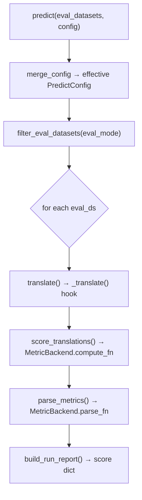

# Choosing a backend

A **backend** is the NMT toolkit that runs underneath `fit` / `predict`. AutoNMT ships
three, all implementing the same `BaseTranslator` contract, so switching is a one-line change
while your data prep, scoring, and reports stay identical. This is the
["Keras for NMT toolkits"](../../concepts/philosophy.md#keras) idea made concrete — and this
page covers both *which* backend to pick and *how* the abstraction lets you swap them.

| Backend | Class | Use it when… | Install |
| --- | --- | --- | --- |
| **AutoNMT** (Lightning) | `AutonmtTranslator` | training a **custom architecture from scratch** with full control over model, decoding, and data pipeline | core |
| **HuggingFace** | `HuggingFaceTranslator` | **fine-tuning or evaluating a pretrained** seq2seq checkpoint (Marian, mBART, NLLB, T5…) | `[hf-models]` |
| **Fairseq** *(deprecated)* | `FairseqTranslator` | reproducing an **existing Fairseq baseline** | `[fairseq]` |

## The one-line swap

The same script, three engines — only the translator object changes:

```python
# Native Lightning engine (custom Transformer)
trainer = AutonmtTranslator.from_dataset(
    train_ds, model=Transformer.from_vocabs(src_vocab, tgt_vocab),
    src_vocab=src_vocab, tgt_vocab=tgt_vocab, run_prefix="exp")

# Fine-tune a pretrained HuggingFace model
trainer = HuggingFaceTranslator.from_dataset(
    train_ds, model_id="Helsinki-NLP/opus-mt-de-en", run_prefix="exp")

# Reproduce a Fairseq baseline (deprecated)
trainer = FairseqTranslator.from_dataset(
    train_ds, src_vocab=src_vocab, tgt_vocab=tgt_vocab, run_prefix="exp")
```

After that line, `trainer.fit(...)` and `trainer.predict(...)` are called the same way, and
`Report` consumes the results identically.

## How they differ underneath

| | AutoNMT | HuggingFace | Fairseq |
| --- | --- | --- | --- |
| Model source | your model | pretrained `AutoModelForSeq2SeqLM` | Fairseq CLI archs |
| Training | PyTorch Lightning | `Seq2SeqTrainer` (fine-tune) | `fairseq-train` (subprocess) |
| Tokenization | dataset's SentencePiece | the model's own HF tokenizer | dataset's SentencePiece |
| Translate mode | [SPM pipeline](#two-translate-modes) | [direct](#two-translate-modes) | SPM pipeline |
| Decoding | AutoNMT's [search strategies](../translation/decoding.md) | `model.generate` | Fairseq's generator |
| Maintained | ✅ actively developed | ✅ supported | ❌ archived 2026-03-20 |

- **[AutoNMT (native)](native.md)** is the only backend where you control the architecture
  and the decoding algorithm — documented in depth across the rest of the User guide.
- **[HuggingFace](huggingface.md)** brings its own tokenizer, so the dataset's subword model
  is irrelevant to it. Best for a strong pretrained starting point.
- **[Fairseq](fairseq.md)** still works but is deprecated; prefer AutoNMT for new work.

## One contract: `BaseTranslator`

Every backend subclasses
[`BaseTranslator`](../../reference/backends.md#autonmt.backends._base.translation_engine.BaseTranslator).
It defines the whole experiment lifecycle once, in shared code, and delegates only the
genuinely toolkit-specific steps to abstract hooks.

The **public surface** is two methods (`fit`, `predict`). The **backend hooks** a subclass
fills in:

| Hook | Required? | Responsibility |
| ---- | --------- | -------------- |
| `_train(train_ds, ...)` | yes | Run the toolkit's training for one variant |
| `_translate(...)` | yes | Produce translations for one (subset, beam) pass |
| `_get_lang_pair() -> (src, tgt)` | yes | Drives eval filtering + the target language for metrics |
| `_get_run_metadata() -> RunMetadata` | optional | Model/vocab info for the report (params, arch, vocab size) |

Everything else — resolving config, persisting it, computing paths, filtering which test
sets to evaluate, scoring, assembling the report — lives in `BaseTranslator` and is
**identical across backends**. Both verbs follow the same recipe — *resolve config → persist
it → dispatch to a hook* — and `predict` adds the shared eval loop:



So a backend author writes *only* `_train` and `_translate` (plus `_get_lang_pair`); the
config plumbing, the per-(subset, beam) loop, the metric routing, and the report schema come
for free.

!!! note "Config precedence & extras"
    `fit`/`predict` accept a typed config ([`FitConfig`](../training/training.md) /
    [`PredictConfig`](../translation/generating.md)) **or** loose kwargs — mixable. The merge
    order is **defaults < `config=` < explicit kwargs**, per key. Any kwarg that isn't a
    config field is a toolkit-specific *extra* forwarded to the backend (`strategy=`,
    `wandb_params=`, `fairseq_args=`, `hf_training_args=`) — and extras win on collision.

## Two translate modes: SPM-pipeline vs direct { #two-translate-modes }

The one real divergence between backends is **who owns tokenization during translation**, and
the contract handles it with a single branch.

- **SPM-pipeline mode (AutoNMT, Fairseq).** Backends that tokenize with the dataset's
  SentencePiece model assign a `SPMTranslatePipeline` in their constructor (`self._spm =
  …`). When `_spm` is set, `translate()` delegates the whole **encode → decode →
  materialize** round-trip to it: the backend's `_translate` only writes `hyp.tok`
  (tokenized hypotheses); the pipeline decodes them to `hyp.txt` and fills `src.txt` /
  `ref.txt` from the original preprocessed files (so model-emitted `<unk>`s don't bias the
  score).
- **Direct mode (HuggingFace).** A backend with its **own** tokenizer leaves `_spm = None`.
  Then `translate()` loops over `(subset, beam)` and calls `_translate` directly, and the
  hook writes `src.txt` / `ref.txt` / `hyp.txt` itself (via `model.generate`).

Either way, the **output artifacts are identical** (`src.txt` / `ref.txt` / `hyp.txt` under
`eval/<eval_ds>/.../beam<N>/`), so `score_translations` and `parse_metrics` consume them
without caring which mode produced them. That's what keeps the output side of the pipeline
truly shared.

## What's shared no matter the backend

Because all three honor the same contract, you always get — for free, identically:

- the same [config persistence + environment snapshot](../../concepts/reproducibility.md),
- the same [`eval_mode`](../translation/generating.md#eval-mode) test-set filtering,
- the same [metric backends](../evaluation/metrics.md) and [report schema](../evaluation/reports.md),
- the same on-disk run layout (only the `<toolkit>` folder name differs:
  `models/autonmt/…`, `models/huggingface/…`, `models/fairseq/…`).

!!! tip "Mix backends in one report"
    Because every backend emits the same flattened score schema, you can drop an AutoNMT
    model, a fine-tuned HuggingFace checkpoint, and a Fairseq baseline into a **single**
    `Report` and compare them in one table. See
    [How-to → Run with another backend](../../how-to/swap-backend.md).

Writing a *new* backend is a small amount of code — implement two or three hooks and decide
your translate mode; the [API reference](../../reference/backends.md) documents the contract.

---

Start with the default: **[Native](native.md)**.
