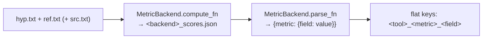

# Metrics

Once a model has translated the test set, AutoNMT scores the hypotheses against the
references. Scoring is wired into [`predict`](../translation/generating.md) — you just list
the metrics — but it's worth understanding what each one measures.

## Requesting metrics

```python
trainer.predict(test_datasets, config=PredictConfig(metrics={"bleu", "chrf", "comet"}))
```

`metrics` is a set of metric names. Each name is routed to the backend that owns it via the
[`MetricBackend` registry](../../reference/evaluation.md), which knows how to both **compute**
the score (writing a `<backend>_scores.json` artifact) and **parse** it back — so there's no
parallel parser to keep in sync.

| Metric | Backend | Needs | What it measures |
| --- | --- | --- | --- |
| `bleu` | sacreBLEU | — | n-gram precision overlap with the reference |
| `chrf` | sacreBLEU | — | character n-gram F-score |
| `ter` | sacreBLEU | — | edit distance to the reference (lower = better) |
| `bertscore` | BERTScore | — | embedding similarity (precision/recall/F1) |
| `comet` | COMET | `unbabel-comet`, source | learned quality estimate (neural) |
| `hg_<name>` | HuggingFace `evaluate` | `[hf]` | any metric on the HF hub |

## String-overlap metrics (sacreBLEU)

!!! info "BLEU, chrF, TER — the intuition"
    - **BLEU** counts how many n-grams (1- to 4-grams) of the hypothesis appear in the
      reference, with a brevity penalty so you can't game it by translating less. It's the
      long-standing default for MT; **higher is better** (0–100). Because tokenization
      changes the score, AutoNMT uses **sacreBLEU**, which fixes tokenization so numbers are
      comparable across papers.
    - **chrF** does the same at the **character** n-gram level. It's more forgiving of
      morphology and word-order variation, which makes it a better fit for agglutinative or
      richly inflected languages.
    - **TER** (Translation Edit Rate) measures the fraction of edits (insert/delete/
      substitute/shift) needed to turn the hypothesis into the reference — so **lower is
      better**.

These three need only `ref` and `hyp`, are fast, and have no extra dependencies. BLEU
records its full sacreBLEU **signature** in the artifact so the exact configuration is
reproducible.

## Neural metrics (BERTScore, COMET)

String overlap misses valid paraphrases ("begin" vs "start"). **Neural metrics** score
meaning instead:

- **BERTScore** embeds hypothesis and reference with a pretrained model and matches tokens by
  cosine similarity, reporting precision/recall/F1. Bundled with the core install.
- **COMET** is a model *trained on human quality judgments* — it tends to correlate best with
  human ratings and is increasingly expected in MT papers. It uses the **source** as well as
  the reference (`needs_src`), so AutoNMT passes `src.txt` through automatically.

```bash
pip install unbabel-comet      # downloads a ~2 GB model on first use
```

```python
trainer.predict(test_datasets, config=PredictConfig(metrics={"bleu", "comet"}))
```

!!! tip "Swapping the COMET model"
    The default checkpoint is `Unbabel/wmt22-comet-da`. Override it with the
    `AUTONMT_COMET_MODEL` environment variable (the model is cached across eval passes so you
    don't re-download it per beam/subset).

## HuggingFace metrics (`hg_*`) { #huggingface-metrics }

Any metric on the HuggingFace `evaluate` hub is available by prefixing its name with `hg_`:

```python
trainer.predict(test_datasets, config=PredictConfig(metrics={"bleu", "hg_meteor", "hg_chrf"}))
```

`hg_meteor` loads `meteor` via `evaluate`. This is an escape hatch for metrics AutoNMT
doesn't ship natively — no code change required. Needs the `[hf]` extra.

## How scoring is wired

Inside `predict`, for each evaluation set / beam / subset:



The parsed values are flattened into keys like `sacrebleu_bleu_score`,
`bertscore_bertscore_f1`, `comet_comet_score` — which is exactly the schema the
[report](reports.md) consumes. Unsupported metric names are warned about and skipped, not
fatal.

!!! note "Adding your own metric"
    Because metrics live behind the `MetricBackend` registry, a new metric is a small
    registration — compute + parse — not a fork. See
    [How-to → Add a custom metric](../../how-to/custom-metric.md).

---

A single number isn't enough to claim an improvement — check it's real with
**[Statistical significance](significance.md)**, then collect everything into
**[Reports & plots](reports.md)**.
