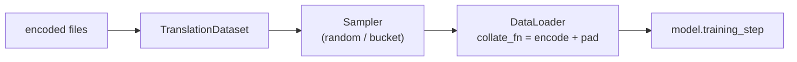

# Bucketing & batching

Between the encoded files on disk and the tensors the model consumes sits the torch-side
data pipeline: the `TranslationDataset` (what one example is), the **samplers** (how
examples are grouped into batches), and the collate step (how a batch becomes padded
tensors). The translator wires all of it during `fit` and `predict`; this page explains it
so the `use_bucketing` / `batch_size` / `max_tokens` knobs make sense — and why bucketing is
often a 2–3× throughput win.

## The fields

| Field | Default | Meaning |
| --- | --- | --- |
| `batch_size` | `128` | Sentences per batch (fixed-size mode) |
| `max_tokens` | `None` | Token budget per batch (variable-size mode) — exactly one of these |
| `use_bucketing` | `False` | Group similar-length sentences into each batch |
| `num_workers` | `0` | DataLoader worker processes |

```python
trainer.fit(train_ds, config=FitConfig(use_bucketing=True, batch_size=128))   # fixed-size buckets
trainer.fit(train_ds, config=FitConfig(use_bucketing=True, max_tokens=8000))  # token-budget buckets
```

## `TranslationDataset`

The torch `Dataset` for parallel text reads the already-encoded `<prefix>.<src>` /
`<prefix>.<tgt>` files into memory as **raw strings** and does the vocab-encoding + padding
lazily, in the collate function:

```python
from autonmt.core.data.translation_dataset import TranslationDataset

tds = TranslationDataset(
    file_prefix=train_ds.get_encoded_path(fname=train_ds.train_name),
    src_lang="de", tgt_lang="en",
    src_vocab=src_vocab, tgt_vocab=tgt_vocab,
    filter_fn=None,    # optional (src_lines, tgt_lines) -> (src_lines, tgt_lines)
)
len(tds)          # number of sentence pairs
tds[0]            # ('a de sentence', 'an en sentence')  — raw strings
```

Keeping encoding in `collate_fn` (not at read time) is deliberate: **vocabulary choice and
`max_tokens` stay DataLoader-time concerns**, so the same on-disk files can be served with
different vocabularies or token budgets without re-reading.

### Collation: encoding + padding

`collate_fn` turns a list of string pairs into padded tensors:

1. encode each side with its `Vocabulary` (adds `<s>` / `</s>`),
2. pad every sequence in the batch to the batch's max length with `<pad>`,
3. return `((x_padded, y_padded), (x_len, y_len))` — tokens and true lengths.

The lengths matter downstream: models build padding masks from them so attention and loss
ignore `<pad>` positions. If you pass `max_tokens`, the collate also enforces a per-batch
token budget.

!!! info "Why padding (and why minimize it)?"
    GPUs need rectangular tensors, but sentences vary in length, so short ones are filled
    with `<pad>` up to the batch maximum. Padding is pure waste — compute spent on tokens
    that don't exist. A batch of mostly-short sentences plus one long one pads *everything*
    to the long one. That's exactly what bucketing avoids.

## Samplers

A **sampler** decides the order examples are drawn in and how they're grouped. AutoNMT ships
three (`autonmt.core.samplers`), and the translator picks one from your config:

| Sampler | Used for | Behavior |
| --- | --- | --- |
| `SequentialSampler` | validation / test | in-order, deterministic |
| `RandomSampler` | training (default) | shuffled each epoch (seeded) |
| `BucketSampler` | training with `use_bucketing=True` | length-grouped batches |

During `fit`, training gets a **random** (shuffled) loader and validation a **sequential**
one; during decoding, evaluation is **always sequential** so `hyp[i]` lines up with
`src[i]`.

## Length bucketing

`BucketSampler` groups sentences of **similar length** into the same batch, so each batch
pads to a tight bound instead of to the longest sentence in the dataset. Two modes (exactly
one of `batch_size` / `max_tokens`):

- **Fixed size** (`batch_size`): every batch has the same number of sentences, but of
  similar length — so padding shrinks.
- **Token budget** (`max_tokens`): batches hold a *variable* number of sentences packed
  under a token ceiling — many short sentences, or few long ones. This keeps memory roughly
  constant per batch regardless of sentence length, the more robust choice for mixed-length
  corpora.

Bucket composition is computed **once**; each epoch only the *order* of batches is reshuffled
(with a per-epoch seed), so the model still sees a fresh sequence every epoch without paying
to re-bucket. For packed-sequence models the sampler can also sort within each batch.

!!! note "Packed-sequence RNNs require bucketing"
    Some RNN variants use PyTorch packed sequences and need sorted-by-length batches, so
    those models *must* run with `use_bucketing=True` — AutoNMT raises a clear error
    otherwise.

!!! warning "Bucketing changes batch composition, not correctness"
    Bucketing alters which sentences share a batch, which can slightly change batch
    statistics and therefore the exact optimization trajectory. It's a speed/memory
    optimization: expect near-identical final quality, not bit-identical loss curves versus
    random batching.

## How it fits together



You normally never instantiate any of it — you set the fields above on
[`FitConfig`](training.md). But every piece is public, so you *can* drive the loop yourself
(custom batching, inspecting tensors); see
[How-to → Drive the pipeline manually](../../how-to/manual-pipeline.md).

---

Last in this section: the escape hatches —
**[Advanced training control](advanced.md)**.
