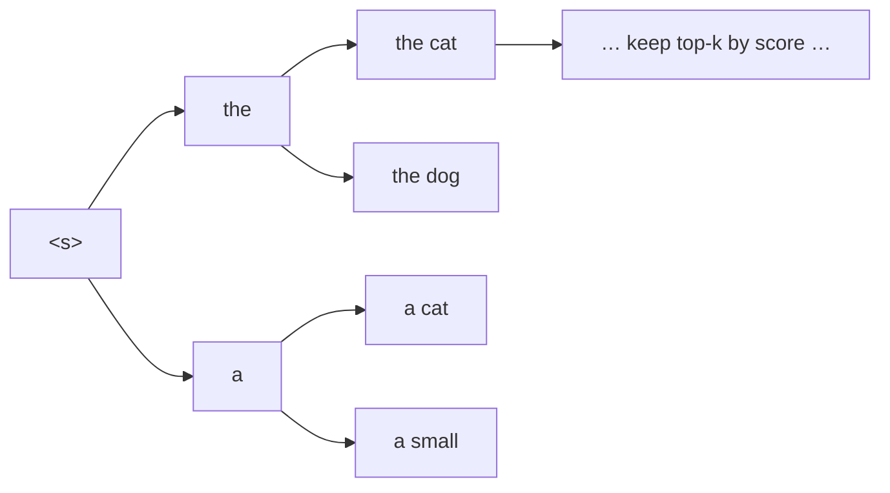

# Decoding strategies

Training teaches the model to predict the next token given the correct prefix. **Decoding**
(a.k.a. *search* or *generation*) is the inference-time problem: there is no correct prefix
anymore, so the model must build the translation one token at a time from its own outputs.
*How* you pick each token — and how much of the search space you explore — is the decoding
strategy, and it can change BLEU by several points without touching the model.

This page explains each strategy from first principles, with the math where it clarifies,
and shows how to select one in [`predict`](generating.md).

## The decoding problem

At each step $t$ the model gives a probability distribution over the vocabulary for the next
token, conditioned on the source $x$ and the tokens generated so far $y_{<t}$:

$$
p(y_t \mid y_{<t}, x)
$$

A full translation is a sequence $y = (y_1, \dots, y_L)$, and its probability is the product
of the per-step probabilities — equivalently, the **sum of log-probabilities**:

$$
\log p(y \mid x) = \sum_{t=1}^{L} \log p(y_t \mid y_{<t}, x)
$$

We'd love the highest-probability $y$, but there are $V^L$ possible sequences — searching
them all is impossible. Every strategy below is a different practical answer to "which
sequence do we actually return?"

## The contract: `BaseSearch`

All strategies implement
[`BaseSearch.decode(...)`](../../reference/core.md#autonmt.core.decoding), returning
`(token_id_lists, optional_scores)`. Greedy and the sampling strategies share a thinner base,
`BaseStepSearch`, which implements the whole loop (DataLoader, encoder call, EOS handling,
length cap) and asks the subclass for just **one** method:

```python
def pick_next_token(self, logits):   # logits: (B, V) at the current step
    return ...                        # → (B,) chosen token id per sequence
```

That's why greedy, temperature, top-k, and nucleus sampling are only a few lines each — they
differ *only* in how they pick from the step's logits. Beam search is structurally different
(it tracks multiple hypotheses) so it implements `decode` directly.

## Greedy search

The simplest rule: at every step, take the single most likely token.

```python
def pick_next_token(self, logits):
    return logits.argmax(dim=-1)
```

Fast and deterministic, but **myopic** — committing to the best token *now* can rule out a
sequence that was better overall. It's the default when beam width is 1.

```python
trainer.predict(test, config=PredictConfig(beams=[1]))   # → greedy
```

## Beam search

Beam search keeps the **$k$ best partial hypotheses** (the *beam*) alive at every step
instead of one. At each step it expands all $k$ hypotheses by every possible next token,
scores the $k \times V$ candidates by cumulative log-probability, and keeps the top $k$.
When a hypothesis emits `</s>` it's finished; at the end the best completed hypothesis wins.



Larger $k$ explores more and usually improves quality up to a point, at roughly linear cost
in $k$.

### Length normalization

Raw log-probability sums **penalize long sequences**: every extra token adds another negative
log-prob, so shorter hypotheses score higher just for being short. Beam search corrects this
by dividing by a power of the length:

$$
\text{score}(y) = \frac{1}{L^{\alpha}} \sum_{t=1}^{L} \log p(y_t \mid y_{<t}, x)
$$

$\alpha$ is the **length penalty** (`length_penalty`):

- $\alpha = 0$ → raw log-probs (favors short outputs).
- $\alpha = 1$ → full length normalization (the default).
- $\alpha > 1$ → actively favors longer hypotheses.

This length penalty was popularized by [Wu et al. (2016)](https://arxiv.org/abs/1609.08144),
whose GNMT system introduced length normalization to stop beam search from favoring short
translations.

```python
from autonmt.core.decoding import BeamSearch

trainer.predict(test, config=PredictConfig(beams=[5]))                         # default α = 1
trainer.predict(test, config=PredictConfig(beams=[5], decoder=BeamSearch(length_penalty=1.2)))  # longer outputs
```

!!! note "Beam search is the default for width > 1"
    If you pass `beams=[5]` without a `decoder`, AutoNMT uses `BeamSearch()` automatically.
    Pass a `decoder=BeamSearch(length_penalty=...)` only to change the penalty. AutoNMT's
    beam search is **batched** and supports the [KV-cached incremental
    decoding](../models/building-blocks.md#the-incremental-autoregressive-decoder) of the
    Transformer, so width-5 search is fast.

## Sampling strategies

Beam search seeks the *most likely* translation — ideal for MT, where you want the single
best answer. But sometimes you want **diversity** (data augmentation, exploring model
behavior, back-translation). Sampling draws from the distribution instead of maximizing it.
All three samplers share a **temperature** knob.

!!! info "What temperature does"
    Temperature $T$ rescales the logits before the softmax, $p_i \propto \exp(z_i / T)$:

    - $T < 1$ **sharpens** the distribution (closer to greedy — safer, less diverse).
    - $T = 1$ is the model's native distribution.
    - $T > 1$ **flattens** it (more diverse, more risky).

    Sampling is non-deterministic — set `torch.manual_seed(...)` for reproducible draws.

### Multinomial (pure temperature) sampling

Sample the next token from the full (temperature-scaled) distribution:

```python
from autonmt.core.decoding import MultinomialSampling
trainer.predict(test, config=PredictConfig(beams=[1], decoder=MultinomialSampling(temperature=1.0)))
```

Maximal diversity, but it can occasionally sample a low-probability token and derail — which
the next two strategies guard against by truncating the tail.

### Top-k sampling

Keep only the $k$ highest-probability tokens, renormalize, and sample from those:

```python
from autonmt.core.decoding import TopKSampling
trainer.predict(test, config=PredictConfig(beams=[1], decoder=TopKSampling(top_k=50, temperature=1.0)))
```

This caps the worst-case mistake (a token outside the top $k$ can never be drawn) while
keeping variety. The drawback: a fixed $k$ is too generous when the model is confident and
too restrictive when it's uncertain — which nucleus sampling fixes. Top-k sampling for
generation was popularized by [Fan et al. (2018)](https://arxiv.org/abs/1805.04833).

### Top-p / nucleus sampling

Keep the smallest set of tokens whose cumulative probability reaches $p$ (the "nucleus"),
then sample from it:

```python
from autonmt.core.decoding import TopPSampling
trainer.predict(test, config=PredictConfig(beams=[1], decoder=TopPSampling(top_p=0.9, temperature=1.0)))
```

The nucleus size **adapts** to the model's confidence: when one token dominates, the nucleus
is tiny (near-greedy); when the model is unsure, it widens. AutoNMT always keeps at least one
token so generation can't stall. Nucleus sampling was introduced by
[Holtzman et al. (2019)](https://arxiv.org/abs/1904.09751).

## Choosing a strategy

| Goal | Strategy |
| --- | --- |
| Best single translation (most research MT) | **Beam search** (width 4–8) |
| Fast, deterministic baseline | **Greedy** (`beams=[1]`) |
| Diverse / augmented outputs, back-translation | **Top-p** or **top-k** sampling |
| Studying the raw distribution | **Multinomial** sampling |

A good default for reported results is beam search with width 5 and the default length
penalty. Sweep the width (`beams=[1, 5, 10]`) when you want to see the quality/cost curve in
one run.

## Custom decoders

Because decoders are just `BaseSearch` / `BaseStepSearch` subclasses, writing your own (a
diverse beam search, a constrained decoder, a length-controlled sampler) is a small class —
see [How-to → Change the decoding strategy](../../how-to/custom-decoding.md).

---

The decoded `hyp.txt` now needs scoring: **[Evaluation → Metrics](../evaluation/metrics.md)**.
