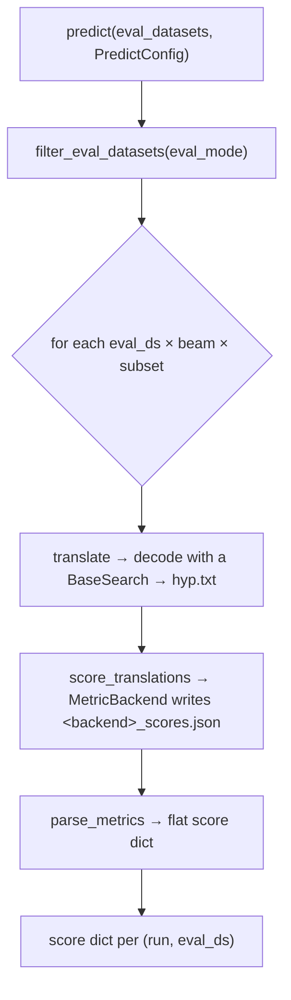

# Generating translations

`predict` takes a trained model and turns the test set into scores. Under the hood it runs
three stages — **translate → score → parse** — for every evaluation set, beam width, and
test subset, then returns a list of score dicts ready for the
[report](../evaluation/reports.md).

```python
from autonmt.backends._base.config import PredictConfig

scores = trainer.predict(
    test_variants,
    config=PredictConfig(
        beams=[1, 5],                 # decode greedily AND with beam width 5
        metrics={"bleu", "chrf"},
        load_checkpoint="best",
        eval_mode="same",
    ),
)
```

## What `predict` does



- **translate** decodes each source sentence into a hypothesis using a [search
  strategy](decoding.md) and writes `src.txt` / `ref.txt` / `hyp.txt`.
- **score** runs the requested [metric backends](../evaluation/metrics.md) over those files.
- **parse** reads the score artifacts back into a flat dict and assembles the per-run report
  entry.

You get one list entry per evaluation dataset; wrap the whole list in a
[`Report`](../evaluation/reports.md).

## `PredictConfig`

| Field | Default | Meaning |
| --- | --- | --- |
| `beams` | `None` → `[1]` | Beam widths to decode with (a list — decode each) |
| `metrics` | `None` → `{"bleu"}` | Metrics to compute (`bleu`, `chrf`, `ter`, `bertscore`, `comet`, `hg_*`) |
| `max_len_a`, `max_len_b` | `1.2`, `50` | Max generated length = `max_len_a · src_len + max_len_b` |
| `batch_size` | `64` | Sentences per decode batch |
| `max_tokens` | `None` | Token budget per batch (alternative to `batch_size`) |
| `load_checkpoint` | `None` | `"best"`, `"last"`, a filename, or an absolute path |
| `eval_mode` | `"same"` | Which eval sets to score — `same` / `compatible` / `all` |
| `decoder` | `None` | A [`BaseSearch`](decoding.md) instance to override the default strategy |
| `preprocess_fn` | `None` | Predict-time source normalization (match training!) |
| `accelerator`, `devices`, `num_workers` | `"auto"`, `"auto"`, `0` | Hardware |
| `force_overwrite` | `False` | Re-translate / re-score even if artifacts exist |

### Beam widths are a list

`beams=[1, 5]` decodes the test set **twice** — greedily and with beam width 5 — and scores
each, so you can compare them in one run. Results are written to separate
`translations/beam1/` and `translations/beam5/` folders, and the report keys include the
beam (`translations.beam5.sacrebleu_bleu_score`).

### Picking the search strategy

By default AutoNMT uses **greedy** decoding when the beam width is 1 and **beam search** when
it's > 1. To use a different strategy (sampling, or beam search with a custom length
penalty), pass a `decoder` instance:

```python
from autonmt.core.decoding import BeamSearch, TopPSampling

# Beam search biased toward longer hypotheses:
trainer.predict(test_variants, config=PredictConfig(beams=[5], decoder=BeamSearch(length_penalty=1.2)))

# Nucleus sampling (stochastic):
trainer.predict(test_variants, config=PredictConfig(beams=[1], decoder=TopPSampling(top_p=0.9)))
```

All strategies, and when to reach for each, are in [Decoding strategies](decoding.md).

!!! info "What do `max_len_a` / `max_len_b` do?"
    A model must be told when to *stop* generating, but it can also fail to emit `</s>` and
    run away. The length cap `max_len_a · src_len + max_len_b` bounds the output relative to
    the source length — translations are roughly proportional to their input, so a slope
    (`a`) plus an intercept (`b`) is a safe ceiling. The defaults (`1.2`, `50`) suit most
    language pairs; raise them for languages that expand significantly.

## Checkpoint selection

`load_checkpoint` chooses which weights to decode with:

- `"best"` — the checkpoint that scored best on `monitor` during training (needs
  `save_best=True` at fit time).
- `"last"` — the final checkpoint (needs `save_last=True`).
- a filename or absolute path — any specific `.pt`.

If you call `predict` right after `fit` in the same process, the in-memory model is already
trained; `load_checkpoint` is what lets you evaluate a *saved* checkpoint in a fresh process
or compare best vs last.

## `eval_mode`: which test sets get scored { #eval-mode }

You can hand `predict` your **entire** `get_test_ds()` list and let it choose what's relevant
to *this* model:

| `eval_mode` | Scores… |
| --- | --- |
| `"same"` *(default)* | only test variants the model trained on |
| `"compatible"` | any variant with the same language pair |
| `"all"` | every variant passed |

This is what makes grid evaluation clean: train each model, pass them all the same test
list, and each model evaluates the subset that makes sense for it.

## Predict-time preprocessing

If you cleaned the training data with a [hook](../data/preprocessing.md#hooks), apply the
equivalent normalization to the test source via `preprocess_fn`, so you measure model
quality and not a preprocessing mismatch:

```python
def clean_source(data, ds):
    return preprocess_lines(data["lines"], normalize_fn=normalize)

trainer.predict(test_variants, config=PredictConfig(preprocess_fn=clean_source))
```

## Splitting the stages

`predict` runs translate → score → parse together, but each is a public method
(`translate`, `score_translations`, `parse_metrics`). Splitting them lets you, for example,
**re-score with a new metric without re-decoding**, or plug a custom decoder per call. That's
covered in [How-to → Drive the pipeline manually](../../how-to/manual-pipeline.md).

---

Next, the strategies themselves: **[Decoding strategies](decoding.md)**.
