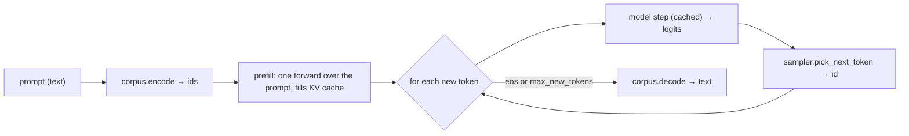

# Text generation & sampling

For a language model there's no test set to _translate_ — you give it a prompt and it
**continues** it. That's what [`LMTrainer.generate`](../../reference/backends.md) does: it
tokenizes the prompt, runs autoregressive decoding with a KV cache, and detokenizes the
result back to text.

```python
from autonmt.core.decoding import GreedySearch, TopPSampling

trainer = LMTrainer.from_corpus(corpus, run_prefix="hello", model=model)
trainer.fit(corpus, block_size=64, max_epochs=5)

# Deterministic:
trainer.generate("the quick brown", sampler=GreedySearch(), max_new_tokens=32)

# Stochastic (nucleus sampling):
trainer.generate("the quick brown", sampler=TopPSampling(top_p=0.9, temperature=0.8),
                 max_new_tokens=32)
```

This is the LM counterpart of [Generating translations](generating.md): same decoding
machinery, different shape (one stream in, one stream out — no encoder, no reference).

## How generation works



The prompt is run through the model **once** to fill the key/value cache, then each new token
is produced from a single cached step — the same $O(L)$-per-step
[incremental decoding](../models/building-blocks.md#the-incremental-autoregressive-decoder)
that makes translation beam search fast. Generation stops at the end-of-sequence token or
after `max_new_tokens`.

## Choosing how to sample

The `sampler` is exactly the same family of [`BaseSearch`](decoding.md) strategies used for
translation — there's nothing LM-specific to learn:

| Sampler                 | Behaviour                                                      | Reach for it when…                          |
| ----------------------- | -------------------------------------------------------------- | ------------------------------------------- |
| `GreedySearch()`        | always the argmax token                                        | you want deterministic, reproducible output |
| `TopKSampling(top_k=k)` | sample from the `k` most likely                                | you want variety but bounded                |
| `TopPSampling(top_p=p)` | sample from the smallest set covering prob. mass `p` (nucleus) | the usual default for open-ended text       |
| `MultinomialSampling()` | sample from the full distribution                              | maximum diversity (and risk)                |

`temperature` (on the sampling strategies) flattens (`>1`) or sharpens (`<1`) the distribution
before sampling. The intuition and math for each strategy live in
[Decoding strategies](decoding.md).

!!! info "Why not always greedy?"
Greedy decoding is deterministic but repetitive — it can loop or collapse onto generic
continuations. **Nucleus (top-p) sampling** keeps only the most probable tokens whose
cumulative mass reaches `p` and samples among them, trading a little coherence for variety
and avoiding the long tail of bad tokens ([Holtzman et al., 2019](https://arxiv.org/abs/1904.09751)).
For a deterministic task (e.g. the reversal example) prefer greedy; for open-ended text,
prefer top-p.

## Instruct models: prompt formatting matters

A model fine-tuned on an [instruct corpus](../data/lm-corpora.md#instruct-mode) learned to
continue a **specific prompt shape**. Generate with the _same_ shape you trained on:

```python
# trained on pairs like ("reverse: a b c", "c b a")
trainer.generate("reverse: d e f g", sampler=GreedySearch(), max_new_tokens=16)
```

By default `generate` prepends `<s>` and stops at `</s>` (`add_sos=True`, `stop_at_eos=True`),
matching how instruct examples were packed.

## The low-level function

`generate` is a thin wrapper over
[`lm_generate`](../../reference/core.md#autonmt.core.decoding.lm_generate), which takes a model
and **token ids** directly — useful when you already hold ids or want to drive batched/custom
generation yourself:

```python
from autonmt.core.decoding.lm_generate import lm_generate

ids = corpus.encode("the quick", add_sos=True)
out_ids = lm_generate(model, ids, sampler=TopPSampling(top_p=0.9), max_new_tokens=32,
                      eos_id=corpus.eos_id)
print(corpus.decode(out_ids))
```

It reuses the same `pick_next_token` strategies as translation decoding — no separate sampling
code.

## Masked language models

This page is about **autoregressive** generation (encoder–decoder and decoder-only models). An
**encoder-only** [masked LM](../data/lm-corpora.md#mlm-mode) is bidirectional and does not
generate left to right — there is no `generate`. Instead, [`MLMTrainer`](../../reference/backends.md)
exposes `fill_mask`, which predicts the token(s) at `<mask>` positions:

```python
mlm_trainer.fill_mask("the <mask> fox jumps", top_k=5)
# -> [["quick", "lazy", "bright", "small", "green"]]
```

See [Pretrain a masked LM](../../how-to/pretrain-masked-lm.md).

---

To measure a model instead of eyeballing samples, see
[Perplexity & LM evaluation](../evaluation/perplexity.md). For the strategies themselves,
[Decoding strategies](decoding.md).
