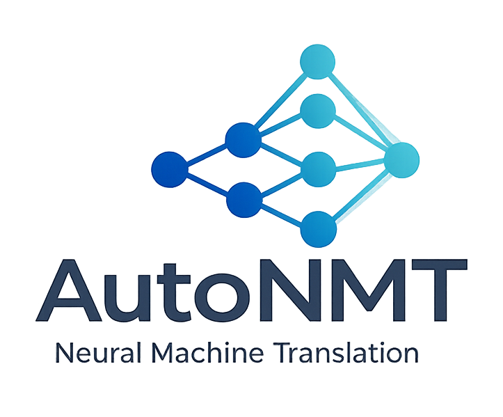

---
hide:
  - navigation
---

<div class="autonmt-hero" markdown>



**Automate the boring half of seq2seq research.**

</div>

AutoNMT is a research framework that automates the repetitive machinery around neural
machine translation experiments — dataset variant generation, tokenization, training,
translation, scoring, logging, plotting, and file management — so you can spend your
time on the part that matters: the model.

You **declare a grid** of datasets × language pairs × training sizes × subword models ×
vocabulary sizes. AutoNMT unrolls the cross-product, runs every cell, persists every
intermediate artifact on disk, and hands you back a single comparable report.

The *same* script can train AutoNMT's own PyTorch Lightning models, fine-tune (or just
evaluate) a HuggingFace seq2seq checkpoint, or shell out to Fairseq — you switch backends
by changing one class.

---

## The shape of an experiment

Every AutoNMT experiment is three composable layers:

```{.text .pipeline}
DatasetBuilder  ───►  Translator  ───►  generate_report
   (the grid)        (fit / predict)     (json + csv + plots)
```

```python
from autonmt.datasets import DatasetBuilder
from autonmt.backends import AutonmtTranslator
from autonmt.backends._base.config import FitConfig, PredictConfig
from autonmt.core.nn.models import Transformer
from autonmt.reporting.report import generate_report

# 1. Declare the grid → AutoNMT materializes every cell on disk
builder = DatasetBuilder(
    base_path="datasets/quickstart",
    datasets=[{"name": "multi30k", "languages": ["de-en"], "sizes": [("original", None)]}],
    encoding=[{"subword_models": ["bpe"], "vocab_sizes": [4000]}],
).build()

train_ds = builder.get_train_ds()[0]
src_vocab, tgt_vocab = train_ds.build_vocabs(max_tokens=150)

# 2. Wrap a model in a translator and run fit / predict
trainer = AutonmtTranslator.from_dataset(
    train_ds, model=Transformer.from_vocabs(src_vocab, tgt_vocab),
    src_vocab=src_vocab, tgt_vocab=tgt_vocab, run_prefix="quickstart",
)
trainer.fit(train_ds, config=FitConfig(max_epochs=3, batch_size=128))
scores = trainer.predict(builder.get_test_ds(), config=PredictConfig(metrics={"bleu"}))

# 3. Turn the scores into a report
generate_report(scores=[scores], output_path="outputs/quickstart")
```

---

## Why AutoNMT

<div class="grid cards" markdown>

-   :material-grid:{ .lg .middle } __Grids, not scripts__

    ---

    Describe the axes you want to sweep. AutoNMT runs the cross-product and gives you one
    table where every cell is directly comparable.

    [:octicons-arrow-right-24: The grid](concepts/grid.md)

-   :material-swap-horizontal:{ .lg .middle } __Backend-agnostic__

    ---

    AutoNMT Lightning models, HuggingFace seq2seq checkpoints, or the Fairseq CLI behind
    one `fit()` / `predict()` surface.

    [:octicons-arrow-right-24: Backends](backends/index.md)

-   :material-folder-cog:{ .lg .middle } __Everything on disk__

    ---

    Each stage is persisted in a numbered folder and skipped on re-run. Inspect, reuse, or
    pin any step.

    [:octicons-arrow-right-24: On-disk layout](concepts/on-disk-layout.md)

-   :material-flask:{ .lg .middle } __Built for reproducibility__

    ---

    One seed seeds everything; every run dumps its full effective config. Built on
    SentencePiece, sacreBLEU, Moses, COMET, BERTScore.

    [:octicons-arrow-right-24: Reproducibility](concepts/reproducibility.md)

</div>

---

## Where to go next

- **New here?** Start with [Installation](getting-started/installation.md) then the
  [Quickstart](getting-started/quickstart.md).
- **Want the mental model?** Read [Philosophy](concepts/philosophy.md) and
  [The pipeline](concepts/pipeline.md).
- **Ready to build?** The [Guides](guides/bring-your-own-data.md) mirror the runnable
  scripts in [`examples/`](https://github.com/salvacarrion/autonmt/tree/main/examples).
- **Looking for a specific class?** Jump to the [API reference](reference/index.md).
