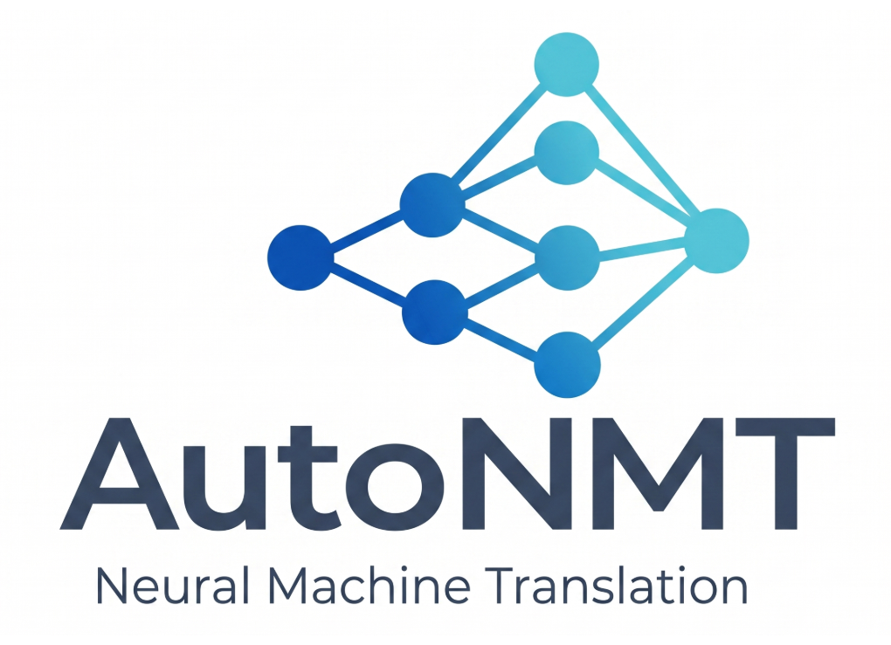

<p align="center">
  
</p>

<p style="font-size: 1.15rem; opacity: 0.85; text-align: center;">
A framework to streamline the research of neural machine translation models.
</p>

AutoNMT takes the **repetitive half** of NMT research off your hands — tokenization,
training, decoding, scoring, logging, plotting, and the file bookkeeping that ties them
together — so the hours you spend are the hours that actually move your research: the
model.

You don't write loops over datasets and hyper-parameters. You **declare a grid** —
datasets × language pairs × subword models × vocabulary sizes — and AutoNMT walks the
cross-product, persists every intermediate artifact in a predictable place on disk, and
hands you one comparable report at the end. Swap a single class and the same script
trains AutoNMT's own PyTorch Lightning models, fine-tunes a HuggingFace checkpoint, or
shells out to Fairseq.

```python
from autonmt.datasets import DatasetBuilder
from autonmt.backends import AutonmtTranslator
from autonmt.backends._base.config import FitConfig, PredictConfig
from autonmt.core.nn.models import Transformer

# 1. Declare the grid → AutoNMT unrolls it into dataset variants on disk.
builder = DatasetBuilder(
    base_path="data",
    datasets=[{"name": "multi30k", "languages": ["de-en"], "sizes": [("original", None)]}],
    encoding=[{"subword_models": ["bpe"], "vocab_sizes": [4000]}],
).build()

train_ds = builder.get_train_ds()[0]
src_vocab, tgt_vocab = train_ds.build_vocabs(max_tokens=150)

# 2. Bind a model to a backend and run the experiment loop.
trainer = AutonmtTranslator.from_dataset(
    train_ds,
    model=Transformer.from_vocabs(src_vocab, tgt_vocab),
    src_vocab=src_vocab, tgt_vocab=tgt_vocab,
    run_prefix="demo",
)
trainer.fit(train_ds, config=FitConfig(max_epochs=3, batch_size=128))
scores = trainer.predict(builder.get_test_ds(), config=PredictConfig(metrics={"bleu"}))
```

That snippet is the whole shape of an AutoNMT experiment: **describe the data, pick a
backend, `fit`, `predict`.** Everything in these docs is about understanding what happens
inside those four steps and how to bend each one to your research.

---

## Where to go next

<div class="grid cards" markdown>

-   :material-lightbulb-on:{ .lg .middle } **New here? Start with the idea**

    ---

    Why AutoNMT exists, its design principles, and the mental model that makes the rest
    click.

    [:octicons-arrow-right-24: Introduction](introduction/why.md)

-   :material-rocket-launch:{ .lg .middle } **Just want to run something**

    ---

    Install AutoNMT and walk through your first end-to-end experiment, line by line.

    [:octicons-arrow-right-24: Get started](get-started/installation.md)

-   :material-sitemap:{ .lg .middle } **Understand how it fits together**

    ---

    The pipeline, the toolkit abstraction that lets backends swap, and the on-disk layout
    behind reproducibility.

    [:octicons-arrow-right-24: Architecture](architecture/building-blocks.md)

-   :material-engine:{ .lg .middle } **Use the native engine in depth**

    ---

    The AutoNMT toolkit, from the high-level `fit`/`predict` down to models, decoding,
    samplers — and full manual control.

    [:octicons-arrow-right-24: The AutoNMT toolkit](toolkit/overview.md)

-   :material-swap-horizontal:{ .lg .middle } **Pick the right backend**

    ---

    When to use AutoNMT's engine, when to fine-tune HuggingFace, and the deprecated
    Fairseq path.

    [:octicons-arrow-right-24: Backends](backends/index.md)

-   :material-chart-bar:{ .lg .middle } **Evaluate and report**

    ---

    Metrics (BLEU, chrF, TER, COMET, BERTScore), significance testing, and comparable
    reports.

    [:octicons-arrow-right-24: Evaluation & reports](evaluation/metrics.md)

</div>

---

!!! note "Who this is for"
    AutoNMT is built for **researchers**. We assume you can write Python and train a
    model, but we do *not* assume every reader is equally fluent in every NMT concept.
    Whenever a piece of machine-translation machinery shows up — subwords, beam search,
    samplers, length penalties — you'll find a short, intuitive primer right next to it,
    so you can keep reading without a detour to a textbook.
