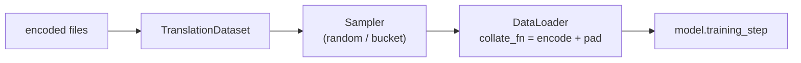

# Samplers & the `TranslationDataset`

Between the encoded files on disk and the tensors a model consumes sits the torch-side data
pipeline: the [`TranslationDataset`](../reference/core.md) (what a single example is) and the
**samplers** (how examples are grouped into batches). The [translator](overview.md) wires
these for you during `fit` and `predict`; this page explains what they do, so the
`use_bucketing` / `max_tokens` knobs make sense.

## `TranslationDataset`

The torch `Dataset` for parallel text. It reads the already-encoded
`<prefix>.<src>` / `<prefix>.<tgt>` files into memory as **raw strings** and does the
vocab-encoding + padding lazily, in the collate function:

```python
from autonmt.core.data.translation_dataset import TranslationDataset

tds = TranslationDataset(
    file_prefix=train_ds.get_encoded_path(fname=train_ds.train_name),
    src_lang="de", tgt_lang="en",
    src_vocab=src_vocab, tgt_vocab=tgt_vocab,
    filter_fn=None,    # optional (src_lines, tgt_lines) -> (src_lines, tgt_lines)
)
len(tds)          # number of sentence pairs
tds[0]            # ('a de sentence', 'an en sentence')  — raw strings
```

Keeping encoding in `collate_fn` (not at read time) is deliberate: it means **vocabulary
choice and `max_tokens` stay DataLoader-time concerns**. The same on-disk encoded files can
be served with different vocabularies or token budgets without re-reading.

### Collation: encoding + padding

`collate_fn` turns a list of string pairs into padded tensors:

1. encode each side with its `Vocabulary` (adds `<s>` / `</s>`),
2. pad every sequence in the batch to the batch's max length with `<pad>`,
3. return `((x_padded, y_padded), (x_len, y_len))` — tokens and true lengths.

The lengths matter downstream: models build padding masks from them so attention and loss
ignore `<pad>` positions. If you pass `max_tokens`, the collate also enforces a per-batch
token budget, dropping the overflow with a warning.

!!! info "Why padding (and why minimize it)?"
    GPUs need rectangular tensors, but sentences vary in length, so short ones are filled with
    `<pad>` up to the batch maximum. Padding is pure waste — compute spent on tokens that don't
    exist. A batch of mostly-short sentences plus one long one pads *everything* to the long
    one. That's exactly what [bucketing](#bucketing) avoids.

## Samplers

A **sampler** decides the order in which examples are drawn and how they're grouped into
batches. AutoNMT ships three, and the translator picks one based on your config:

| Sampler | Used for | Behavior |
| --- | --- | --- |
| `SequentialSampler` | validation / test | in-order, deterministic |
| `RandomSampler` | training (default) | shuffled each epoch (seeded) |
| `BucketSampler` | training with `use_bucketing=True` | length-grouped batches |

During `fit`, the translator builds a **random** (shuffled) loader for training and
**sequential** loaders for validation; during decoding, evaluation is always sequential so
`hyp[i]` lines up with `src[i]`.

## Length bucketing { #bucketing }

`BucketSampler` groups sentences of **similar length** into the same batch. Because each batch
then pads to a tight bound instead of to the longest sentence in the dataset, far less compute
is wasted on padding — often a 2–3× throughput win on natural length distributions.

```python
trainer.fit(train_ds, config=FitConfig(use_bucketing=True, batch_size=128))   # fixed-size buckets
trainer.fit(train_ds, config=FitConfig(use_bucketing=True, max_tokens=8000))  # token-budget buckets
```

Two batching modes (exactly one of `batch_size` / `max_tokens`):

- **Fixed size** (`batch_size`): every batch has the same number of sentences, but they're of
  similar length, so padding shrinks.
- **Token budget** (`max_tokens`): batches have a *variable* number of sentences packed under a
  token ceiling — many short sentences or few long ones. This keeps memory roughly constant
  per batch regardless of sentence length, which is the more robust choice for mixed-length
  corpora.

Bucket composition is computed once; each epoch only the **order** of batches is reshuffled
(with a per-epoch seed), so the model still sees a fresh sequence every epoch without paying
to re-bucket.

!!! note "Bucketing and packed-sequence RNNs"
    Some RNN variants use PyTorch packed sequences and require sorted-by-length batches —
    those models *must* run with `use_bucketing=True` (AutoNMT raises a clear error otherwise).
    The bucket sampler can additionally sort within each batch for them.

!!! warning "Bucketing changes batch composition, not correctness"
    Bucketing alters which sentences share a batch, which can slightly change batch statistics
    and therefore the exact optimization trajectory. It's a speed/memory optimization; expect
    near-identical final quality, not bit-identical loss curves versus random batching.

## How it fits together

During `fit`, the [translator](overview.md) assembles this stack for you:



You normally never instantiate any of it directly — you set `use_bucketing` / `batch_size` /
`max_tokens` / `num_workers` on [`FitConfig`](training.md). But if you want to drive the loop
yourself (custom batching, inspecting tensors), every piece is public — see
[Full manual control](manual-control.md).

---

Last in this chapter: assembling everything by hand — **[Full manual control](manual-control.md)**.
