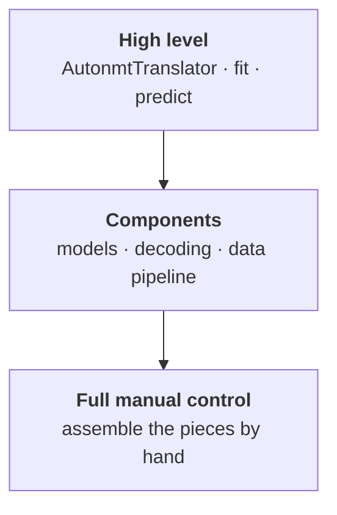
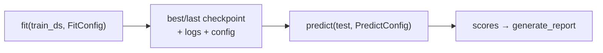

# The AutoNMT toolkit

This is AutoNMT's **own** neural engine — the part you'll use when you want to train a
custom architecture from scratch with full control, rather than fine-tuning someone else's
checkpoint. It's a small, readable PyTorch Lightning stack wrapped by the
[`AutonmtTranslator`](../reference/backends.md) backend.

Because it's the toolkit AutoNMT owns end to end, it gets the deepest treatment in these
docs — and it's the reference implementation of the [translator
contract](../architecture/toolkit-abstraction.md) every other backend mirrors.

## Three altitudes

You can work with the engine at three levels of control. The chapter is organized along
them, so pick the altitude you need:



| Altitude | You write | Pages |
| --- | --- | --- |
| **High level** | `fit` / `predict` with configs — AutoNMT owns the loop | [Training](training.md), [Translating & decoding](predict.md) |
| **Components** | swap a model, a decoder, a sampler | [Models](models.md), [Decoding](decoding.md), [Data pipeline](data-pipeline.md) |
| **Full manual control** | drive every step yourself, split the pipeline | [Full manual control](manual-control.md) |

Most experiments live at the high level and reach down a rung when they need to. The
components and the manual-control page exist so that reaching down is *documented*, not
guesswork.

## The translator

[`AutonmtTranslator`](../reference/backends.md) wraps a [`LitSeq2Seq`](models.md) model with
PyTorch Lightning. It owns the DataLoaders, callbacks (early stopping, checkpointing),
loggers (TensorBoard / W&B), checkpoint loading, and the decoding step — so the two verbs
`fit` and `predict` are all you call.

```python
from autonmt.backends import AutonmtTranslator
from autonmt.core.nn.models import Transformer

src_vocab, tgt_vocab = train_ds.build_vocabs(max_tokens=8000)

trainer = AutonmtTranslator.from_dataset(
    train_ds,
    model=Transformer.from_vocabs(src_vocab, tgt_vocab),
    src_vocab=src_vocab, tgt_vocab=tgt_vocab,
    run_prefix="exp",
)
```

### `from_dataset` vs the plain constructor

`from_dataset(train_ds, run_prefix=..., **kwargs)` is the convenient path: it resolves the
on-disk **run location** (`models/autonmt/runs/<run_name>/`) and the run name from the
dataset variant, so checkpoints, logs, and translations land in the right place
automatically. Equivalent to:

```python
AutonmtTranslator(
    model=...,
    src_vocab=src_vocab, tgt_vocab=tgt_vocab,
    runs_dir=train_ds.get_runs_path(toolkit="autonmt"),
    run_name=train_ds.get_run_name(run_prefix="exp"),
)
```

Calling the constructor directly is the [manual path](manual-control.md#manual-translator) —
useful when you want a custom `run_name` (`"ablation-v2-seed42"`) or a different directory
scheme.

## The experiment loop

`fit` then `predict` is the whole cycle:

```python
from autonmt.backends._base.config import FitConfig, PredictConfig

trainer.fit(train_ds, config=FitConfig(max_epochs=10, batch_size=128))
scores = trainer.predict(test_variants, config=PredictConfig(beams=[5], metrics={"bleu", "chrf"}))
```



- [**`fit`**](training.md) trains the model: builds train/val DataLoaders, configures the
  optimizer/scheduler/criterion, attaches callbacks and loggers, and saves checkpoints.
- [**`predict`**](predict.md) decodes the test set(s) with a [search
  strategy](decoding.md), scores the output with the requested
  [metrics](../evaluation/metrics.md), and returns score dicts ready for the
  [report](../evaluation/reports.md).

Both accept either a typed config or loose kwargs (and a mix), with precedence **defaults <
`config=` < kwargs** — see [config precedence](../architecture/toolkit-abstraction.md).

## What's under the engine

The rest of the chapter opens each component:

- [**Training (`fit`)**](training.md) — `FitConfig`, optimizers, LR schedules, callbacks,
  loggers, bucketing, seeding.
- [**Translating & decoding (`predict`)**](predict.md) — `PredictConfig`, the
  translate→score flow, `eval_mode`, checkpoints.
- [**Models & the `LitSeq2Seq` contract**](models.md) — built-in architectures, the layer
  library, and the three methods a custom model implements.
- [**Decoding strategies**](decoding.md) — greedy, beam search (with the math), and
  sampling, explained from first principles.
- [**Samplers & the `TranslationDataset`**](data-pipeline.md) — the torch-side data
  plumbing: batching, padding, and length bucketing.
- [**Full manual control**](manual-control.md) — assemble all of the above by hand.
